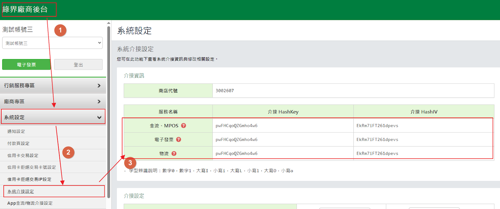

======
Taiwan
======

Configuration
=============

Modules installation
--------------------

:ref:`Install <general/install>` the following modules to get all the features of the Taiwanese
localization:

.. list-table::
   :header-rows: 1

   * - Name
     - Technical name
     - Description
   * - :guilabel:`Taiwan - Accounting`
     - `l10n_tw`
     - This is the base module to manage the accounting chart for Taiwan.
   * - :guilabel:`Taiwan - E-invoicing`
     - `l10n_tw_edi_ecpay`
     - This module allows the user to send their invoices to the Ecpay system.
   * - :guilabel:`Taiwan - E-invoicing Ecommerce`
     - `l10n_tw_edi_ecpay_website_sale`
     - This module allows the user to input Ecpay information in ecommerce for sending their invoices to the Ecpay system.
   * - :guilabel:`Taiwan - Accounting Reports`
     - `l10n_tw_reports`
     - This module includes the accounting reports for Taiwan.

ECPay Integration
=================

Odoo supports integration with ECPay to submit generated invoices directly to their system. The
:guilabel:`Taiwan - E-invoicing` module (`l10n_tw_edi_ecpay`) is required for this functionality.

Set-up
------

To configure the integration, valid credentials must be retrieved from the
'ECPay vendor backend <https://vendor.ecpay.com.tw/User/LogOn_Step1>`_. The required information
includes:

- :guilabel:`MerchantID`
- :guilabel:`Hashkey`
- :guilabel:`HashIV`

Configuration in Odoo
~~~~~~~~~~~~~~~~~~~~~

[cite_start]Open the Accounting app, navigate to the :guilabel:`Taiwan Electronic Invoicing` section, and fill in the :guilabel:`MerchantID`, :guilabel:`HashKey`, and :guilabel:`HashIV` fields. [cite: 15]

.. note::
   [cite_start]For testing purposes, do not use real credentials. [cite: 17] [cite_start]Instead, use the Staging information provided by ECPay (https://developers.ecpay.com.tw/?p=24174) and enable the :guilabel:`Staging mode` field. [cite: 17]

Contacts
--------

[cite_start]In Taiwan, a clear distinction exists between B2B (Business-to-Business) and B2C (Business-to-Consumer) invoices. [cite: 19] [cite_start]This distinction is managed via the Contacts app configuration. [cite: 20]

- [cite_start]**Company (B2B)**: When the customer is a company, select the :guilabel:`Company` option and ensure the :guilabel:`Tax ID` is filled. [cite: 21] [cite_start]The :guilabel:`Email` or :guilabel:`Phone` fields should also be filled in. [cite: 22]
- [cite_start]**Individual (B2C)**: When the customer is an individual, select the :guilabel:`Individual` option. [cite: 23] [cite_start]Provide an :guilabel:`Email` or :guilabel:`Phone` number. [cite: 24]

.. note::
   - [cite_start]An invoice sent to an individual partner belonging to a Company partner is treated as a B2B invoice (associated with the parent Company). [cite: 26]
   - [cite_start]An invoice sent to an individual partner not belonging to a Company is treated as a B2C invoice. [cite: 27]

Taxes
-----

[cite_start]The standard tax rate in Taiwan is 5%, though special tax rates apply to specific industries. [cite: 29] [cite_start]To configure special taxes Gross Business Receipts Tax (GBRT), go to :menuselection:`Accounting --> Configuration --> Taxes` and create a new tax. [cite: 30]

[cite_start]Configure the following: [cite: 31]

- [cite_start]Fill in the standard fields (Tax Name, Tax Type, Tax Computation, Tax Scope). [cite: 32]
- [cite_start]For :guilabel:`Ecpay Tax Type`, select :guilabel:`Taxable (special tax rate)`. [cite: 33]
- [cite_start]A new field, :guilabel:`Ecpay Special Tax Type`, will appear. [cite: 34] [cite_start]Select the applicable industry. [cite: 34]

.. tip::
   [cite_start]**Example**: If "Saloons and tea rooms, coffee shops and bars offering companionship services: Tax rate is 25%" is selected, enter `25` in the Amount field. [cite: 36]

Workflow
========

Send invoices to ECPay
----------------------

B2C Invoice (Individual)
~~~~~~~~~~~~~~~~~~~~~~~~

#. [cite_start]Navigate to :menuselection:`Accounting --> Customers --> Invoices` and create a new invoice. [cite: 40]
#. [cite_start]Select a customer of the type :guilabel:`Individual` (who does not belong to a company). [cite: 41]
#. [cite_start]Open the :guilabel:`Ecpay` tab to configure delivery options: [cite: 42]

   - [cite_start]:guilabel:`Get Printed Version`: Check this to allow the customer to receive a printable ECPay invoice. [cite: 43]
   - [cite_start]:guilabel:`Love Code`: Enter the Love Code if the customer wishes to donate the invoice to a charity. [cite: 44]
   - [cite_start]:guilabel:`Carrier Type`: Select this if the customer uses a cloud-based carrier. [cite: 45] [cite_start]Enter the :guilabel:`Carrier Number` (and Carrier Number 2 if required) when prompted. [cite: 46]

#. [cite_start]Confirm the invoice, then click :guilabel:`Print & Send`. [cite: 47] [cite_start]Ensure the :guilabel:`Send to Ecpay` checkbox is selected. [cite: 47]
#. [cite_start]The :guilabel:`Invoice Status`, :guilabel:`Ecpay Invoice Number`, and :guilabel:`Creation Date` in the Ecpay tab will update automatically upon successful submission. [cite: 48]

.. note::
   [cite_start]Ecpay invoice is also accessible in Odoo when the "Get Printed Version" option is checked: [cite: 50] [cite_start]Click the gear icon, then click "Print Ecpay invoice", select the Print Format (B2C) field, and then click the button "Print Invoice". [cite: 51]

B2B Invoice (Company)
~~~~~~~~~~~~~~~~~~~~~

#. [cite_start]Create an invoice and select a :guilabel:`Company` customer (or an individual belonging to a company). [cite: 53]
#. [cite_start]Confirm the invoice, click :guilabel:`Print & Send`, and ensure :guilabel:`Send to Ecpay` is selected. [cite: 54]
#. [cite_start]The :guilabel:`Invoice Status`, :guilabel:`Ecpay Invoice Number`, and :guilabel:`Creation Date` in the Ecpay tab will update automatically upon successful submission. [cite: 55]

.. important::
   [cite_start]Ensure the :guilabel:`Tax ID` field of the customer is filled in with the Tax Identification Number; [cite: 56] [cite_start]otherwise the invoice will not be sent to ECPay successfully. [cite: 57]

.. note::
   - [cite_start]For the B2B invoice, the Ecpay invoice can be printed out/ downloaded by default: click the gear icon, then click :guilabel:`Print Ecpay invoice`. [cite: 59]
   - [cite_start]The user can also check the Ecpay invoice number and the Invoice status in the log note. [cite: 60]

Invoice Cancellation
--------------------

[cite_start]To cancel a submitted invoice: [cite: 62]

#. [cite_start]Open the invoice and click :guilabel:`Request Cancel`. [cite: 63]
#. [cite_start]In the pop-up window, provide a cancellation :guilabel:`Reason`, then click :guilabel:`Cancel Invoice`. [cite: 64]
#. [cite_start]The :guilabel:`Invoice Status` will change to :guilabel:`Invalid`, and the :guilabel:`Invalidate Reason` will be recorded in the Ecpay tab. [cite: 65]

Send credit notes to ECPay
--------------------------

B2C Credit Notes
~~~~~~~~~~~~~~~~

[cite_start]Before sending a credit note, the original invoice must be successfully submitted to ECPay. [cite: 68] [cite_start]To send a credit note to ECPay, click "Credit Note", and then: [cite: 69]

#. [cite_start]Click :guilabel:`Credit Note` on the invoice. [cite: 70]
#. [cite_start]Enter the :guilabel:`Reason displayed on Credit Note`. [cite: 71]
#. [cite_start]Select the :guilabel:`Agreement Type` (Offline or Online). [cite: 72]
#. [cite_start]Select the :guilabel:`Allowance Notify Way` (Email or Phone). [cite: 73]
#. [cite_start]Click :guilabel:`Confirm`, then :guilabel:`Print & Send`, ensuring :guilabel:`Send to Ecpay (Issue Allowance)` is selected. [cite: 74]
#. [cite_start]The :guilabel:`Refund State` will update to :guilabel:`Agreed` (for Offline agreements) or :guilabel:`To be agreed` (for Online agreements); [cite: 75] [cite_start]the Refund Invoice Number, Refund invoice Agreement Type and Allowance Notify Way will also be updated accordingly. [cite: 76]

B2B credit notes
~~~~~~~~~~~~~~~~

#. [cite_start]Click :guilabel:`Credit Note` and enter the :guilabel:`Reason displayed on Credit Note`. [cite: 78]
#. [cite_start]Click :guilabel:`Confirm`, then :guilabel:`Print & Send`, ensuring :guilabel:`Send to Ecpay (Issue Allowance)` is selected. [cite: 79]
#. [cite_start]The :guilabel:`Refund Invoice Number` is updated automatically. [cite: 80]

.. note::
   [cite_start]Credit note amount cannot go over original invoice amount. [cite: 82]

E-commerce
==========

[cite_start]To enable direct invoice submission via eCommerce: [cite: 84]

#. [cite_start]Go to :menuselection:`Website --> Configuration --> Settings`. [cite: 85]
#. [cite_start]In the :guilabel:`Invoicing` section, enable :guilabel:`Automatic Invoice`. [cite: 86]
#. [cite_start]This ensures invoices are generated and sent to ECPay automatically once online payment is confirmed. [cite: 87]

Checkout Process
----------------

- [cite_start]**B2C Customers**: During checkout, customers must select "Request a paper copy" to receive a physical invoice. [cite: 89] [cite_start]If "No" is selected, no copy is provided. [cite: 90] [cite_start]If "Yes," the invoice can be downloaded from the invoice view. [cite: 90]
- [cite_start]**B2B Customers**: An :guilabel:`Invoicing Info` page appears after delivery confirmation. [cite: 91] [cite_start]Customers can choose to donate the invoice or select an :guilabel:`Ecpay e-invoice carrier`. [cite: 92]

.. note::
   - [cite_start]If no option has been selected, a Print Ecpay invoice can still be downloaded from the invoice view. [cite: 94]
   - [cite_start]If an invoice fails to be sent to ECPay, error messages can be reviewed in the :guilabel:`Log Note` of the invoice. [cite: 96] [cite_start]Successful transmissions are verified in the :guilabel:`Ecpay` tab. [cite: 97]