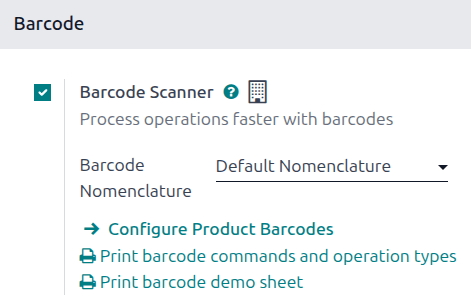
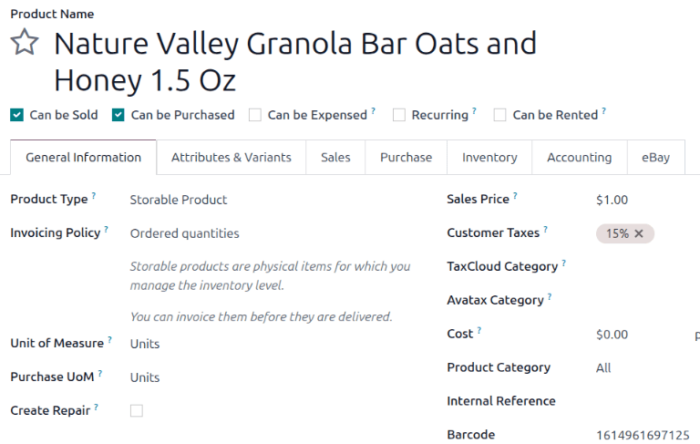
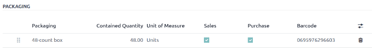
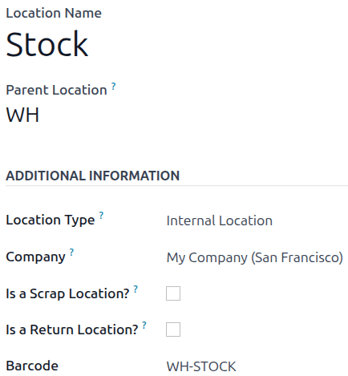

=========================
Activate barcodes in Odoo
=========================

.. _inventory/barcode/software:

The barcode scanning features can save a lot of time usually lost switching between mouse and
keyboard and the scanner. Properly attributing barcodes to products, product packagings, pickings,
and locations helps ensure efficient workflows by controlling software almost exclusively with the
barcode scanner.

Configuration
=============

To use this feature, navigate to :menuselection:`Inventory app --> Configuration --> Settings`. In
the *Barcode* section, select :guilabel:`Barcode Scanner`. Be sure to click :guilabel:`Save`.

Barcode formats
---------------

It is possible to use *default nomenclature* for the barcodes in the database. Default nomenclature
supports barcode actions using product universal product codes (UPCs) and European Article Number
(EAN) barcodes.

It is also possible to use *default GS1 nomenclature*. GS1 nomenclature consolidates various product
and supply chain data into a single barcode. Most retail products use EAN-13 barcodes, also known as
GTIN (Global Trade Identification Numbers). GTINs are used by companies to uniquely identify their
products and services. While GTIN and UPC are often used synonymously, GTIN refers to the number a
barcode represents, while UPC refers to the barcode itself. More information about GTINs can be
found on the `GS1 website <https://www.gs1.org/standards/get-barcodes>`__.

In order to create GTINs for items, a company must have a GS1 company prefix. This prefix is the
number that appears at the beginning of each GTIN, and identifies the company as the owner of
the barcode. To learn more about GS1 company prefixes, or purchase a
license for a prefix, visit the `GS1 Company Prefix
<https://www.gs1.org/standards/id-keys/company-prefix>`__ page.

Odoo supports GTIN barcodes to identify products. However, since Odoo supports any numeric string as
a barcode, it is also possible to define a custom barcode for internal use.

.. seealso::
   - :doc:`../operations/gs1_nomenclature`
   - :doc:`../operations/barcode_nomenclature`

Set product barcodes
====================

Assign barcodes to products via the *Inventory* app. Navigate to :menuselection:`Inventory app -->
Products --> Products`. Open the product to which a barcode should be added, or create a new product
by clicking :guilabel:`New`.

On the product form, make sure the *General Information* tab is open. Enter a barcode in the
:guilabel:`Barcode` field.

.. note::
    Be sure to add barcodes directly on the product variants and not on the product. To set a
    barcode for a product variant, create the variant in the *Attributes & Variants* tab. Then,
    navigate to :menuselection:`Inventory app --> Products --> Product Variants`. Select the
    variant. On its product variant form, in the *General Information* tab, enter a barcode in the
    :guilabel:`Barcode` field.

    .. image:: software/product-variant-barcode.png
       :alt: Assign a barcode to individual product variants.

.. _barcode/setup/packaging-barcode:

Set product packaging barcodes
==============================

Assign barcodes for product packagings to ensure that they can be used for receipts, deliveries, and
more. Product packagings must be enabled before you can create packagings or assign barcodes to
those packagings. Navigate to :menuselection:`Inventory app --> Configuration --> Setttings`. In the
*Products* section, select :guilabel:`Product Packagings`. Be sure to click :guilabel:`Save`.

Add barcodes for packagings in the *Inventory* app. Navigate to :menuselection:`Inventory app -->
Products --> Products`. Open the product to which a packaging barcode must be added, or create a new
product by clicking :guilabel:`New`.

On the product form, after you have specified a product name and other information in the *General
Information* tab, open the *Inventory* tab. In the *Packaging* section, click the
:icon:`oi-settings-adjust` :guilabel:`(additional options)` icon, then select :guilabel:`Barcode`.
Then, add a barcode to existing packagings, or click :guilabel:`Add a line` to create a new
packaging and add a barcode to it.

.. seealso::
   :doc:`../../inventory/product_management/configure/packaging`

.. _barcode/setup/location:

Set location barcodes
=====================

If you manage multiple locations, attribute a barcode to each location and print it to display on
the physical location in the warehouse. You can configure the locations barcodes in
:menuselection:`Inventory app --> Configuration --> Locations`.

.. note::
   Print the barcode for the location by clicking the :icon:`fa-cog` :guilabel:`(Actions)` icon and
   selecting :icon:`fa-print` :guilabel:`Location Barcode`. The barcode saves to the computer,
   and it can be opened to print from the computer.
