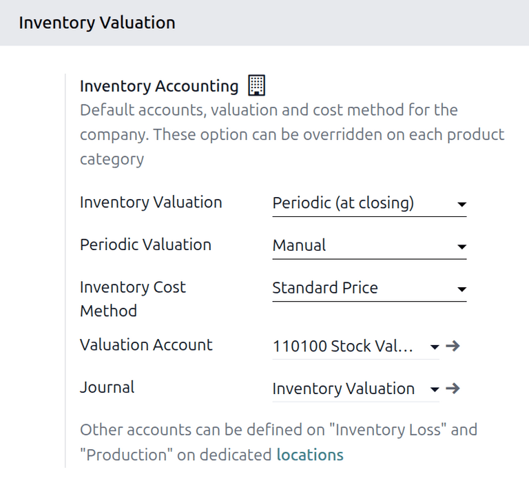
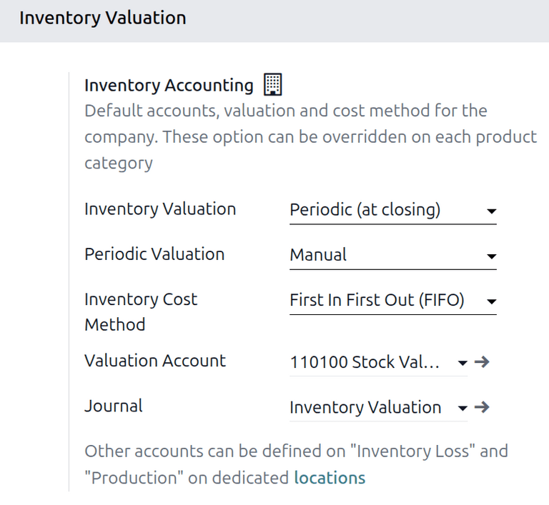
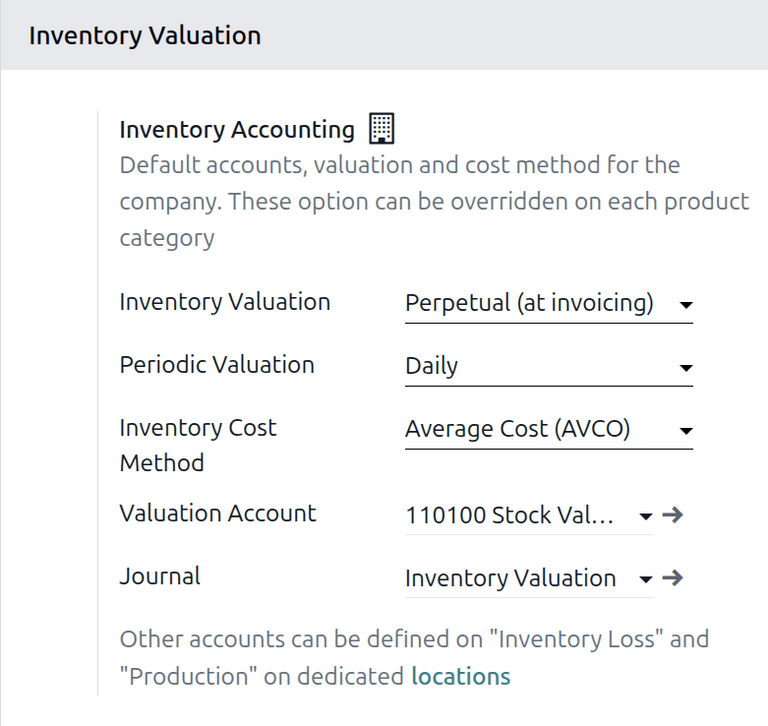

===================================
Operation-based inventory valuation
===================================

.. |PO| replace:: :abbr:`PO (purchase order)`
.. |POs| replace:: :abbr:`POs (purchase orders)`
.. |FIFO| replace:: :abbr:`FIFO (first in first out)`
.. |AVCO| replace:: :abbr:`AVCO (average cost)`
.. |SO| replace:: :abbr:`SO (sales order)`

Odoo inventory valuation has removed valuation layers in V19.0 and shifted to a stock move inventory
valuation method. Inventory valuation is now entirely dependent upon relevant stock moves to
calculate stock value instead of valuation layers created upon products entering and exiting from a
warehouse.

In the V19.0 Odoo **Inventory** app, inventory valuation is dependent on stock operations.
This article covers how specific inventory operations affect inventory value and accounting entries.

This document is intended for readers are unfamiliar with which Odoo **Inventory** app actions cause
inventory valuation changes. Understanding how inventory is valued in Odoo is important because it
influences tax implications, management decisions, financial reporting, and more.

.. seealso::
   - :doc:`Scrapped goods<../../../inventory_and_mrp/inventory/inventory_valuation/scrapped_inventory_valuation>`
   - :doc:`Valuation cheat sheet<../../../inventory_and_mrp/inventory/inventory_valuation/cheat_sheet>`
   - :doc:`Landed costs<../../../inventory_and_mrp/inventory/inventory_valuation/landed_costs>`

.. _inventory/inventory_valuation/operation_based_value/inventory-change-table:

Inventory valuation change table
================================

.. list-table::
   :class: table-striped
   :widths: 20 40 40
   :header-rows: 1
   :stub-columns: 1

   * - Changes
     - V18.0 and before
     - V19.0 and after
   * - Conceptual
     - Valuation layers
     - Stock move valuation
   * - Terminology
     - Continental
     - Periodic
   * -
     - Anglo-saxon
     - Perpetual
   * - Data Bloat
     - Redundant journal entries
     - Unique journal entries
   * - Automation
     - Less
     - More
   * - Constraints
     - More
     - Less (ex. can backdate transfers)
   * - Closing
     - No user interface
     - Guided closing

.. _inventory/inventory_valuation/operation_based_value/settings-and-config:

Settings and configuration
==========================

To view and adjust costing method and inventory valuation settings, navigate to
:menuselection:`Settings --> Accounting --> Inventory Valuation`, then :guilabel:`Inventory
Accounting` :icon:`fa-building-o` section under :guilabel:`Inventory Valuation`.

Every inventory valuation setting comes set with a default account/option and can be changed.

.. _inventory/inventory_valuation/operation_based_value/invent-valuation:

Inventory valuation
-------------------

The :guilabel:`Inventory Valuation` category can be set to either :guilabel:`Periodic (at closing)`
or :guilabel:`Perpetual (at invoice)` by clicking on the default cateogry or by selecting the
:icon:`fa-caret-down` icon.

:guilabel:`Perpetual (at invoicing)` comes from the accounting school of Anglo-Saxon accounting.
While it is historically common in the United States, United Kindom, and other Commonwealth
countries, in contemorary times it is more commonly associated with larger companies than a
particular geographic region.

:guilabel:`Periodic (at closing)` comes from the school of Continental accounting. While it is
historically common in mainland Europe, in contemporary times it is more commonly associated with
small businesses than with a particular geographic region.

.. list-table::
   :class: table-striped
   :widths: 20 40 40
   :header-rows: 1
   :stub-columns: 1

   * - Differences
     - Perpetual
     - Periodic
   * - Record timing
     - Automated; Updated instantly after every sale or purchase
     - Manual; Updated at the end of the period
   * - COGS calculation
     - Continuous; recognized at the moment of invoice
     - Formulaic
   * - Ledger accuracy
     - Reflects current warehouse value
     - Only accurate after a manual physical count
   * - Physical counts
     - Used for auditing and shrinkage identification
     - Mandatory for invontory period end value
   * - Implementation
     - Integrated software needed
     - Minimal data entry until end of period
   * - Best for
     - High-volume sales and complex manufacturing
     - Small businesses with infrequent product turnover

.. _inventory/inventory_valuation/operations_based_value/periodic-valuation:

Periodic valuation
------------------

The :guilabel:`Periodic Valuation` category can be set to either :guilabel:`Manual`,
:guilabel:`Daily`, or :guilabel:`Monthly` by clicking on the default category or by selecting the
:icon:`fa-caret-down` icon.

:guilabel:`Periodic Value` refers to the periodicity, or rate, at which journal entries are created.
The desired option will depend entirely on individual business context, such as whether the business
manufactures or purchases products, the volume of inventory turnover, and other factors.

.. _inventory/inventory_valuation/operation_based_value/inventory-cost-method:

Inventory cost method
---------------------

The :guilabel:`Inventory Cost Method` category can be set to either :guilabel:`Standard Price`,
:guilabel:`First In First Out (FIFO)`, or :guilabel:`Average Cost (AVCO)` by clicking on the default
category or by selecting the :icon:`fa-caret-down` icon.

.. list-table::
   :class: table-striped
   :widths: 10 30 30 30
   :header-rows: 1
   :stub-columns: 1

   * - Differences
     - Standard Price
     - First In First Out
     - Average cost
   * - Valuation factors
     - Products are valued at a fixed, manually defined cost regardless of purchase price
     - Products are valued based on the cost of the oldest available stock move
     - Products are valued based on the weighted average of all stock moves currently on hand
   * - Timing
     - Valuation is static; any difference between purchase price and standard cost is recorded as a
       Price Variance
     - Valuation is dynamic; when products are delivered, the cost of the earliest received move is
       removed first
     - Valuation is dynamic; the average cost is recalculated every time a new receipt is validated

.. _inventory/inventory_valuation/operation_based_value/valuation-account:

Valuation account
-----------------

The :guilabel:`Valuation Account` is the general ledger asset account used to record the financial
value of physical stock. Odoo uses this account to increase or decrease the total value of a
company's inventory assets.

By default, Odoo sets the account as :guilabel:`110100 Stock Valuation`. This account can be changed
by clicking on the default account or by selecting the :icon:`fa-caret-down` icon.

.. important::
   In perpetual accounting, Odoo maintains double-entry bookkeeping by using interim holding
   accounts to record inventory value temporarily. This ensures the balance sheet remains accurate
   during the variance phase — after a product is physically moved but before the corresponding bill
   or invoice is finalized.

The *Valuation Account* plays a different role depending on the valuation method selected:

In perpetual valuation this account is updated in real-time. Every stock move triggers a journal
entry that increases or decreases this account's balance immediately.

In periodic valuation this account serves as a static record of the last known inventory value. It
stores the value of quantities from the previous period until a new inventory adjustment or closing
entry is encoded to update it.

.. _inventory/inventory_valuation/operation_based_value/journal:

Journal
-------

The :guilabel:`Journal` is the specific accounting ledger where Odoo posts the inventory valuation
entries. While Odoo provides a default inventory valuation journal, users can customize this to
separate specific stock operation types or regional branch entries.

.. note::
   In perpetual valuation, Odoo posts to this journal automatically upon stock movement or invoice
   validation. In periodic valuation, entries are only posted when the valuation closing process is
   triggered.

.. seealso::
   - :doc:`Work in progress<../../../inventory_and_mrp/manufacturing/basic_setup/work_in_progress>`

.. WIP article is not live yet, so the link will not function until then.

.. _inventory/inventory_valuation/operation_based_value/periodic-accounting:

Periodic
========

In periodic inventory valuation, inventory operations (e.g. receipts and deliveries) update physical
stock quantities immediately, but do not trigger automatic journal entries in the General Ledger.

The financial value of these moves is held in a pending state until the period is closed.

To better understand how inventory operations influence inventory valuation in Odoo V19.0. navigate
though to the :ref:`Inventory Valuation Settings
<inventory/inventory_valuation/operation_based_value/settings-and-config>`.

.. example::
   A typical periodic inventory valuation configuration.

Workflow: Purchasing FIFO stock
-------------------------------

To follow-along with this periodic workflow, set :guilabel:`Inventory Valuation` to
:guilabel:`Periodic (at closing)`, :guilabel:`Periodic Valuation` to :guilabel:`Manual`,
:guilabel:`Inventory Cost Method` to :guilabel:`First In First Out (FIFO)`, and leave the
:guilabel:`Stock Valuation` and :guilabel:`Journal` options as default.

.. important::
   In periodic accounting, valuation is only recorded *once* a period during guided closing.

Start by making a new purchase order (PO) for an |FIFO| product by following
:menuselection:`Purchase --> Orders --> Purchase Orders`, then select :guilabel:`New`.

In this instance, the database is prepared with our product *FIFO*.

.. seealso::
   - :doc:`Product Configuration<../../../inventory_and_mrp/inventory/product_management/configure/type>`

The :guilabel:`Unit Price` will be set to `$100` and the quantity will be set to `1`.

Click through the |PO| buttons :guilabel:`Confirm Order`, :guilabel:`Receive`, then
:guilabel:`Validate`.

.. note::
   Validating updates the :guilabel:`Moves Analysis` report (Warehouse data).

At this stage, the **Balance Sheet** and the **Stock Valuation** asset reports will not show the
$100 increase. In periodic accounting, these physical moves are stored in the "Waiting Room" of the
inventory module.

.. admonition:: Remember

   In periodic accounting, the system is designed to ignore the financial side of things until the
   very end of the month/year when the closing process occurs.

Yet when we check the *Moves Analysis* page, the $100 FIFO product is present. To see the pending
value, navigate to :menuselection:`Inventory --> Reporting --> Moves Analysis`.

Moves Analysis: Shows that the move happened and Odoo knows it's worth $100.

Because in periodic accounting, stock moves are recorded physically but are not automatically
synchronized financially.

Stock (Valuation Report): In Periodic mode, this report usually reflects the Initial Balance (what
you had at the start of the period). It won't update the "Valuation" column in the ledger sense
because no Journal Entry was created.

"Nothing happens": Correct. In Periodic, Odoo does not create a Journal Entry upon validation. It
only creates a Stock Move. Your Balance Sheet still thinks you have $0 in inventory.

Verifying pending value
-----------------------

To see value that has been physically received but not yet financially posted, navigate to
:menuselection:`Inventory --> Reporting --> Moves Analysis`.

* **Stock Variation:** Shows the **$300** pending value from the receipts.
* **Finalized / Initial Balance:** Shows the value already recognized in the ledger (currently $0).

.. admonition:: Summary

   Physical validation updates the **Moves Analysis** (Warehouse data), but the ledger remains
   untouched until the **Guided Closing** is performed.

.. _inventory/inventory_valuation/operation_based_value/perpetual-accounting:

Perpetual
=========

Perpetual valuation synchronizes the warehouse and the ledger in real-time. Every stock move
triggers an automated journal entry, using **Interim Accounts** to bridge the timing difference
between physical movement and financial invoicing.

To better understand how inventory operations influence inventory valuation in Odoo V19.0. navigate
though to the :ref:`Inventory Valuation Settings
<inventory/inventory_valuation/operation_based_value/settings-and-config>`.

.. note::
   The following workflow will focus primarily on inventory valuation. Supporting information for
   specific supporting actions will be provided via interlinking where appropriate.

.. example::
   A typical perpetual inventory valuation configuration.

Workflow: Purchasing AVCO stock
-------------------------------

To follow-along with this perpetual workflow, set :guilabel:`Inventory Valuation` to
:guilabel:`Perpetual (at invoicing)`, :guilabel:`Periodic Valuation` to :guilabel:`Daily`,
:guilabel:`Inventory Cost Method` to :guilabel:`Average Cost (AVCO)`, and leave the :guilabel:
`Stock Valuation` and :guilabel:`Journal` options as default.

Start by making a new purchase order (PO) for an |AVCO| product by following
:menuselection:`Purchase --> Orders --> Purchase Orders`, then selecting :guilabel:`New`.

In this instance, the database is prepared with our product *AVCO*.

.. seealso::
   - :doc:`Product Configuration<../../../inventory_and_mrp/inventory/product_management/configure/type>`

The :guilabel:`Unit Price` will be set to `$50` and the quantity will be set to `1`.

Click through the |PO| buttons :guilabel:`Confirm Order`, :guilabel:`Receive`, then
:guilabel:`Validate`.

Check :menuselection:`Accounting --> Review --> Inventory --> Inventory Valuation`. The **$50** is
now visible in the **Stock Variation** column because the stock has moved.

The stock will also be visible in :menuselection:`Inventory --> Reporting --> Moves Analysis`.

Synchronization via Invoicing
-----------------------------

When a Vendor Bill is uploaded and confirmed for this |PO|:

#. Odoo recognizes the final cost of the goods.
#. The value moves from the **Stock Variation** category to the **Initial Balance** category on the
   Valuation dashboard.
#. The **Stock Interim (Received)** account is cleared, and the value is finalized in the **Stock
   Valuation** asset account.

.. admonition:: Remember

   Perpetual valuation requires **Interim Accounts** to maintain a "real-time" Balance Sheet while
   awaiting the final bill/invoice.

To learn more about the aspects of manufacturing costs:

.. seealso::
  - :doc:`Manufacturing order costs<../../../inventory_and_mrp/manufacturing/basic_setup/mo_costs>`

.. _inventory/inventory_valuation/operation_based_value/closing:

Guided closing
==============

Guided Closing is a dedicated interface in Odoo v19.0 that reconciles warehouse activity with the
financial ledger. It pushes pending stock moves into the General Ledger by generating corrective
journal entries and serves to align the physical and financial realities.

Closing can be generated manually or by automating it in
:ref:`settings<inventory/inventory_valuation/operation_based_value/settings-and-config>` upon
initial setup of inventory valuation.

Manual closing process
----------------------

To update your Balance Sheet when periodic valuation is set to **Manual**:

Navigate to :menuselection:`Accounting --> Review --> Inventory Valuation` and review the
:guilabel:`Stock Variation` section. This represents the total value of all moves validated since
the last closing. Click :guilabel:`Generate Entry`. In the pop-up wizard, select the Period End Date
and click :guilabel:`Generate`. Locate the newly created Draft Journal Entry, review the values, and
click :guilabel:`Post`.

Automated closing
-----------------

If :guilabel:`Periodic Valuation` is set to :guilabel:`Daily` or :guilabel:`Monthly`, Odoo
automatically runs this logic at the end of the specified interval. However, users can still trigger
a manual closing at any time to see real-time financial data.

.. note::
   All inventory valuation calculations are based on **physical inventory dates** (the date the
   transfer was validated), not the date of the Purchase Order or Invoice.

.. admonition:: Remember

   All inventory valuation calculations are based on *physical* inventory dates.

.. _inventory/inventory_valuation/operation_based_value/inventory-ops-and-inventory-valuation:

Effects of inventory actions
============================

.. list-table::
   :class: table-striped
   :widths: 30 25 45
   :header-rows: 1
   :stub-columns: 1

   * - Inventory action
     - Valuation method
     - Effects Accounting Ledger?
   * - Confirm sales order
     - Perpetual / Periodic
     - **No.** This is a contractual intent, not a stock move.
   * - Confirm purchase order
     - Perpetual / Periodic
     - **No.** This is a contractual intent, not a stock move.
   * - Validate receipt
     - Perpetual
     - **Yes.** Increases asset value (Debit) vs. Interim account (Credit).
   * -
     - Periodic
     - **No.** Updates stock quantities but creates no journal entry.
   * - Validate delivery
     - Perpetual
     - **Yes.** Decreases asset value (Credit) vs. Interim account (Debit).
   * -
     - Periodic
     - **No.** Updates stock quantities but creates no journal entry.
   * - Internal transfer
     - Perpetual / Periodic
     - **No.** Moving items between your own locations within a single company does not change
       company value.
   * - Confirm vendor bill
     - Perpetual
     - **Yes.** Synchronizes the stock interim account to accounts payable.
   * -
     - Periodic
     - **Yes.** Records the expense, but remains independent of stock value.
   * - Scrap product
     - Perpetual / Periodic
     - **Yes.** Removes value from assets; records as an expense/loss.
   * - Inventory adjustment
     - Perpetual
     - **Yes.** Immediate ledger update for found or lost stock.
   * -
     - Periodic
     - **No.** Adjustment is saved but only hits the ledger at closing.
   * - **Landed costs**
     - Perpetual
     - **Yes.** Retrospectively adds shipping/duties to the product move value.
