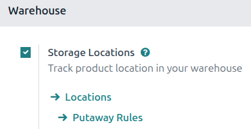
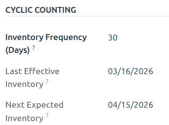
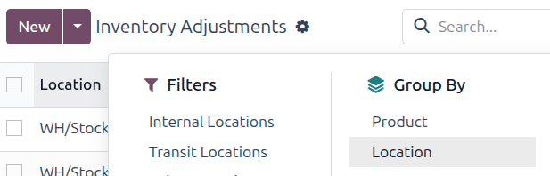

============
Cycle counts
============

For most companies, warehouse stock only needs to be counted once a year. This is why, by default,
the scheduled date for the next inventory count is set for the 31st of December of the current year.

However, for some businesses, maintaining an accurate inventory count is crucial. These companies
use *cycle counts* to keep critical stock levels accurate. Cycle counting is a method by which
companies count their inventory more often in certain *locations* to ensure that their physical
inventory counts match their inventory records.

Configuration
=============

In Odoo, cycle counts are performed by location. Therefore, the *Storage Locations* feature needs to
be enabled before performing a cycle count.

To enable this feature, navigate to :menuselection:`Inventory app --> Configuration --> Settings`,
and scroll down to the *Warehouse* section. Then, select the checkbox next to :guilabel:`Storage
Locations` and click :guilabel:`Save`.

Counting inventory at a set frequency
=====================================

After the *Storage Locations* feature is enabled and locations are created in the warehouse, the
inventory count frequency can be changed for specific locations, and counts can be conducted on
those locations.

Setting a cycle count frequency
-------------------------------

To view and edit locations, navigate to :menuselection:`Inventory app --> Configuration -->
Locations`. This opens a *Locations* page listing every location currently created in the warehouse.

From this page, click a location to open its form.

Under the *Cyclic Counting* section, locate the :guilabel:`Inventory Frequency (Days)` field, which
is set to `0` by default (if this location has not been edited previously). In this field, change
the value to any number of days desired for the frequency of counts.

.. example::
   A location that needs an inventory count every 30 days should have the :guilabel:`Inventory
   Frequency (Days)` value set to `30`.

Now, to ensure the scheduled cycle count appears as expected, :ref:`perform the first cycle count
<inventory/warehouses_storage/cycle_count_perform>`. After inventory adjustments have been
applied to the products in this location, the next scheduled count date is automatically set based
on the value entered in the :guilabel:`Inventory Frequency (Days)` field.

.. _inventory/warehouses_storage/cycle_count_perform:

Performing a cycle count
------------------------

To perform a cycle count for a specific location in the warehouse, navigate to
:menuselection:`Inventory app --> Operations --> Physical Inventory`. This opens an *Inventory
Adjustments* page that lists all products currently in stock, with each product on its own line.

From this page, the :guilabel:`Filters` and :guilabel:`Group By` options (accessible by clicking the
:icon:`fa-caret-down` :guilabel:`(down arrow)` icon to the right of the :guilabel:`Search` bar) can
be used to select specific locations and perform inventory counts.

To select a specific location and view all products within that location, click the
:icon:`fa-caret-down` :guilabel:`(down arrow)` icon to the right of the :guilabel:`Search` bar.
Then, in the :guilabel:`Group By` column, select :guilabel:`Location`.

All products are sorted into their storage locations on the *Inventory Adjustments* page, and a
cycle count can be performed for all products in that location.

.. tip::
   In large warehouses with multiple locations and a high volume of products, it might be easier to
   search for the desired location. To do this, from the *Inventory Adjustments* page, click the
   :icon:`fa-caret-down` :guilabel:`(down arrow)` icon to the right of the :guilabel:`Search` bar.

   Then, in the :guilabel:`Filters` column, click :guilabel:`Add Custom Filter` to open an *Add
   Custom Filter* pop-up window.

   In the first field, click the value and select :guilabel:`Location` from the list of options.
   Select :guilabel:`contains` in the second field. In the third field, type in the name of the
   location being searched for.

   Click :guilabel:`Add` for that location to appear on the page.

   .. image:: cycle_counts/cycle-counts-add-custom-filter.png
      :alt: Add Custom Filter pop-up window with location values entered.

.. note::
   When performing counts in the *Barcode* app, inventory adjustments are grouped by location by
   default.

Change full inventory count date
================================

While cycle counts are typically performed on the location, companies should conduct a full
inventory count once per year. In addition to keeping stock counts accurate, full inventory counts
ensure that accounting earnings and costs are recorded accurately. The scheduled date for full
inventory counts of all in-stock products in the warehouse can be manually changed to push it up
earlier than the listed date.

To modify the default scheduled date, go to :menuselection:`Inventory app --> Configuration -->
Settings`. Then, in the *Operations* section, locate the :guilabel:`Annual Inventory Day and Month`
setting, which includes drop-down fields set to `31` :guilabel:`December` by default.

.. image:: cycle_counts/cycle-counts-frequency-calendar.png
   :alt: Frequency field in inventory app settings.

To change the day, click the `31` and select a day within the range `1-31`, depending on the desired
month of the year.

Then, to change the month, click :guilabel:`December` to reveal the drop-down menu and select the
desired month.

After all necessary changes have been made, click :guilabel:`Save`.

.. seealso::
   - :doc:`count_products`
   - :doc:`use_locations`
