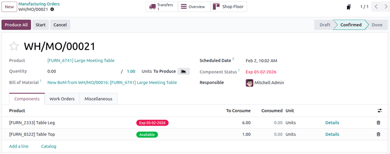
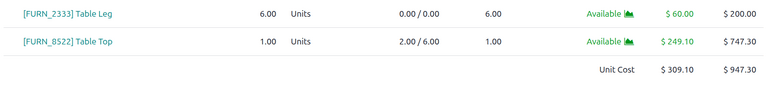

================
Work in progress
================

.. |MO| replace:: :abbr:`MO (manufacturing order)`
.. |WIP| replace:: :abbr:`WIP (work in progress)`
.. |BOM| replace:: :abbr:`BoM (bill of materials)`
.. |MOs| replace:: :abbr:`MOs (manufacturing orders)`

Sometimes, manufacturing processes can take extended periods to complete before a product is ready
to be sold. In those situations, *work in progress* (WIP) entries can help to accurately reflect the
value of partially completed goods in financial statements, as well as potential insights on where
cash might be tied up in the manufacturing process.

Odoo **Manufacturing** allows users to post and reverse |WIP| entries associated with manufacturing
orders (MOs) to track the value of materials, labor, and overhead consumed while products are being
manufactured. These entry amounts are based on costs that *have already been incurred* during the
manufacturing process, not on planned or estimated costs.

.. note::
   |WIP| only applies to |MOs| that are in progress.

   :doc:`Landed Costs<../../../inventory_and_mrp/inventory/inventory_valuation/landed_costs>` and
   Costs of Goods Sold are not included in |WIP| because these factors are only relevant before or
   after the manufacturing process.

How WIP is calculated
=====================

Each component of |WIP| is derived from actual consumption recorded on the manufacturing order, not
from the bill of materials or planned costs.

The |WIP| value is calculated using the following equation:

.. math::

   \text{WIP} = \text{Direct Materials Consumed} + \text{Direct Labor Consumed} +
   \text{Overhead Consumed}

The terms used in the equation are defined as follows:

- **Direct**: The ability to trace a cost back to a specific |MO|.

- **Consumed**: What has actually been used in the manufacturing process so far.

- **Overhead**: The support costs of the manufacturing process. This is primarily captured via work
  center costs.

.. note::

   Because Odoo allows an hourly rate to be set by specific work center, indirect costs (e.g. work
   center machine electricity) become traceable because Odoo keeps track of usage.

.. seealso::

   - :doc:`Manufacturing order costs<../../../inventory_and_mrp/manufacturing/basic_setup/mo_costs>`

.. example::

   In an *MO Overview*, the *Unit Cost* column represents planned costs, while the *Real Cost*
   column reflects actual incurred costs that are recorded in |WIP| entries. Overhead costs are
   grouped under the *Operations* section.

Material consumption
--------------------

Consumption of materials is a key element in determining |WIP| values. To understand what this looks
like in Odoo, it's helpful to demonstrate through a bill of materials and |MO| Overview.

.. note::
   A bill of materials (BoM) is a preconfigured list of components needed to manufacture a product.
   Each component has an associated cost and quantity required for production.

.. seealso::

   - :ref:`Setting component costs <manufacturing/mo-costs/component-cost>`

To navigate to a |BOM|, start with :menuselection:`Manufacturing --> Products --> Bill of
Materials`, then select :guilabel:`New` or click on an existing configuration.

When a new manufacturing order is created, a |BOM| can be selected to populate the components needed
for production.

The column :guilabel:`To Consume` indicates the quantity of each component that needs to be consumed
for the order based on the |BOM|. The :guilabel:`Consumed` column shows how much of each component
has already been consumed for the order and is subject to change.

Consumed materials can be adjusted manually to reflect actual usage during the manufacturing
process.

.. tip::
    Materials can also be marked as consumed by employees via the **Shop Floor** app or by using
    barcode scanning.

The |BOM| :guilabel:`Unit Cost` in this case is fixed at `$309.10` while the actual consumed
material cost reflected in the far right column shows `$947.30`.

Initial |WIP| entries reflect consumed costs, not predicted or estimated costs.

.. _manufacturing/basic_setup/work_in_progress/configuration-wip-accounts:

Configure WIP accounts
======================

To configure |WIP| accounts, navigate to :menuselection:`Accounting --> Configuration --> Settings`,
then scroll down to the *Inventory Valuation* section.

Under the *Manufacturing* section, select the accounts for both of the drop-down fields:

- :guilabel:`WIP Account`: tracks the value of |WIP| goods. The default account is **110500 Work in
  Progress**.
- :guilabel:`WIP Overhead Account`: tracks overhead costs. The default account is **110400 Cost of
  Production**.

By default, the Odoo database has pre-configured accounts for tracking the value of |WIP| goods and
|WIP| overhead costs. These default accounts can be replaced with custom accounts.

.. _manufacturing/basic_setup/work_in_progress/wip-entries:

WIP entries
===========

|WIP| accounting entries are not automatically tied to |MO| progress. They reflect costs at the
moment the entry is posted, based on what has already been consumed. These entries must be posted
manually in order to accurately reflect |WIP| valuation in the **Accounting** app.

|WIP| entries need to be reversed once the manufacturing process is complete. These entries are used
to temporarily reflect manufacturing consumption and need to be returned to an empty state in order
to be used again in another period. If needed, they can be reversed manually.

.. _manufacturing/basic_setup/work_in_progress/initial-wip-entries:

Post initial WIP entries
------------------------

To post initial |WIP| entries, go to :menuselection:`Manufacturing -->  Operations --> Manufacturing
Orders` and access the desired order, then click the :icon:`fa-cog` icon and select :guilabel:`Post
WIP Accounting Entry`.

In the *Post WIP Accounting Entry* window, select the |WIP| accounting journal. Adjust the dates and
line items as needed, then click **Post WIP**.

:ref:`Verify the entries are posted<manufacturing/basic_setup/work_in_progress/verify-wip-entries>`
by reviewing the :guilabel:`Balance Sheet` report for that period.

.. _manufacturing/basic_setup/work_in_progress/reversing-wip-entries:

Reverse WIP entries
-------------------

.. attention::
   By default, an action is automatically scheduled for the next day to reverse the initial |WIP|
   entries once they are posted. If needed, this can be adjusted when :ref:`posting the initial WIP
   entry <manufacturing/basic_setup/work_in_progress/initial-wip-entries>` using the
   :guilabel:`Reversal Date` field.

To manually reverse |WIP| entries, go to :menuselection:`Manufacturing -->  Operations -->
Manufacturing Orders`, and access the desired order.

Click the :guilabel:`WIP` smart button to display the |WIP| entries associated with it.

Then, select the relevant reversal entry, click :icon:`fa-cog` :guilabel:`Actions` and select
:guilabel:`Confirm Entries`.

:ref:`Verify the reversal is posted<manufacturing/basic_setup/work_in_progress/verify-wip-entries>`
by reviewing the :guilabel:`Balance Sheet` report for that period.

.. note::
   If the |WIP| entries do not appear as expected in the *Balance Sheet*, double-check the dates and
   filters applied to ensure they align with the posting and reversal dates of the |WIP| entries.

.. _manufacturing/basic_setup/work_in_progress/verify-wip-entries:

Verify WIP entries
------------------

To verify that |WIP| entries are being :ref:`posted
<manufacturing/basic_setup/work_in_progress/initial-wip-entries>` and :ref:`reversed
<manufacturing/basic_setup/work_in_progress/reversing-wip-entries>` correctly,  go to
:menuselection:`Accounting --> Reporting --> Balance Sheet`.

|WIP| entries are classified as an inventory asset account. The values should reflect manufacturing
consumption at the time of posting and return to zero once reversed.

.. important::
   Verify that the specific period desired is selected.
