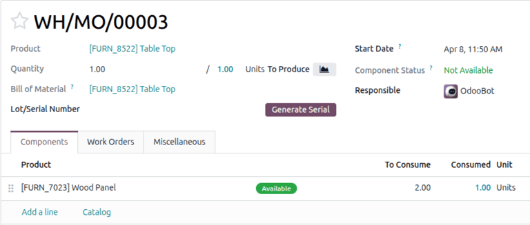
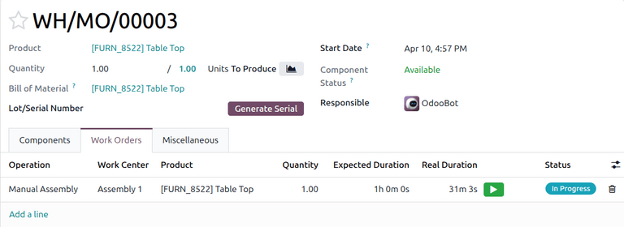
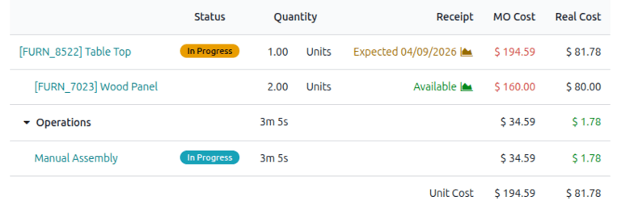

======================
Work-in-progress costs
======================

.. |WIP| replace:: :abbr:`WIP (work in progress)`
.. |BOM| replace:: :abbr:`BoM (bill of materials)`
.. |MO| replace:: :abbr:`MO (manufacturing order)`
.. |MOs| replace:: :abbr:`MOs (manufacturing orders)`

When manufacturing processes take extended periods to complete, temporary *work-in-progress (WIP)*
:ref:`accounting journal entries <cheat_sheet/journals>` can help to accurately reflect the value of
partially completed goods in financial statements, as well as potential insights on where cash might
be tied up in the manufacturing process.

The **Manufacturing** app provides the option to manually post and reverse |WIP| journal entries
associated with an ongoing manufacturing order (MO) to account for the *real cost* of components,
work centers, and labor that have already been incurred at the time the entry is posted.

.. _manufacturing/basic_setup/wip-costs:

Costs included in WIP entries
=============================

Consumption that is factored into the |WIP| accounting entry can be viewed in the |MO|. Those values
are used to calculate the total *real cost* in the |MO| overview.

.. seealso::
   To configure the unit prices and hourly rates used to calculate |WIP| costs, see
   :doc:`Manufacturing order costs <mo_costs>`.

.. _manufacturing/basic_setup/wip-consumption:

Consumption
-----------

To view the *consumed* component quantities for a |WIP| order, navigate to
:menuselection:`Manufacturing --> Operations --> Manufacturing Orders`, then select the |MO|. In the
:guilabel:`Components` tab, the :guilabel:`Consumed` column shows the quantity that has already been
consumed for each component in the |MO|.

To view the *real duration* of work order operations for a |WIP| order, navigate to
:menuselection:`Manufacturing --> Operations --> Manufacturing Orders`, then select the |MO|. In the
:guilabel:`Work Orders` tab, the :guilabel:`Real Duration` column shows the duration of work that
has already been carried out for each operation in the |MO|.

.. _manufacturing/basic_setup/wip-real-costs:

Real costs
----------

To view the *real costs* of consumed components and labor, click the :guilabel:`Overview` smart
button to visit the *MO Overview*. The :guilabel:`MO Cost` column represents planned costs based on
the bill of materials, while the :guilabel:`Real Cost` column reflects actual incurred costs that
will be recorded in the |WIP| entry. Work center overhead costs and labor costs are grouped together
under the *Operations* section. The totals for both the :guilabel:`MO Cost` (expected) and
:guilabel:`Real Cost` (incurred) are displayed in the :guilabel:`Unit Cost` row at the bottom.

Amounts displayed in red or green highlight significant differences between the :guilabel:`MO Cost`
and :guilabel:`Real Cost` for each line item. This can help identify potential issues in the
manufacturing process, such as unusually high component prices or slow operations.

.. _manufacturing/basic_setup/wip-configuration:

Configuration
=============

By default, the Odoo database tracks the value of |WIP| costs under the *Current Assets*
:ref:`account type <chart-of-account/type>`. These default accounts can be replaced with custom
accounts.

To configure |WIP| accounts, navigate to :menuselection:`Accounting --> Configuration --> Settings`,
then scroll down to the *Inventory Valuation* section. Under the *Manufacturing* section, select the
accounts for both of the drop-down fields:

- :guilabel:`WIP Account`: tracks the value of |WIP| goods. The default account is **110500 Work in
  Progress**.
- :guilabel:`WIP Overhead Account`: tracks overhead costs. The default account is **110400 Cost of
  Production**.

.. _manufacturing/basic_setup/wip-entry-workflow:

WIP entry workflow
==================

|WIP| accounting entries are not automatically tied to |MO| progress. They reflect costs at the
moment the entry is posted, based on what has already been consumed. These entries must be
:ref:`manually posted <manufacturing/basic_setup/post-wip-entries>` in order to accurately reflect
|WIP| valuation in the **Accounting** app.

|WIP| entries also need to be :ref:`reversed <manufacturing/basic_setup/reverse-wip-entries>` once
the manufacturing process is complete. These entries are used to temporarily reflect manufacturing
consumption and need to be returned to an empty state in order to be used again in another period.
If needed, they can be reversed manually.

.. _manufacturing/basic_setup/post-wip-entries:

Post WIP entries
----------------

To manually post |WIP| entries:

#. Go to :menuselection:`Manufacturing --> Operations --> Manufacturing Orders` and access the
   desired order.
#. Click the :icon:`fa-cog` icon and select :guilabel:`Post WIP Accounting Entry`.
#. In the *Post WIP Accounting Entry* window, select the |WIP| accounting journal.
#. Adjust the dates and line items as needed, then click **Post WIP**.
#. :ref:`Verify the entries are posted <manufacturing/basic_setup/verify-wip-entries>` by reviewing
   the :guilabel:`Balance Sheet` report for that period.

.. _manufacturing/basic_setup/reverse-wip-entries:

Reverse WIP entries
-------------------

To manually reverse |WIP| entries:

#. Go to :menuselection:`Manufacturing --> Operations --> Manufacturing Orders` and access the
   desired order.
#. Click the :guilabel:`WIP` smart button to display the |WIP| entries associated with it.
#. Select the relevant reversal entry, click :icon:`fa-cog` :guilabel:`Actions`, and select
   :guilabel:`Confirm Entries`.
#. :ref:`Verify the reversal is posted<manufacturing/basic_setup/verify-wip-entries>` by reviewing
   the :guilabel:`Balance Sheet` report for that period.

.. note::
   By default, an action is automatically scheduled for the next day to reverse the initial |WIP|
   entries once they are posted. If needed, this can be adjusted when :ref:`posting the initial WIP
   entry <manufacturing/basic_setup/post-wip-entries>` using the :guilabel:`Reversal Date` field.

.. _manufacturing/basic_setup/verify-wip-entries:

Verify WIP entries
------------------

To verify that |WIP| accounting entries are being :ref:`posted
<manufacturing/basic_setup/post-wip-entries>` and :ref:`reversed
<manufacturing/basic_setup/reverse-wip-entries>` correctly, go to :menuselection:`Accounting -->
Reporting --> Balance Sheet`. The values should reflect manufacturing consumption at the time of
posting and return to zero once reversed.

.. tip::
   If the |WIP| accounting entries do not appear as expected in the *Balance Sheet*, double-check
   the dates and filters applied to ensure they align with the posting and reversal dates of the
   |WIP| accounting entries.
