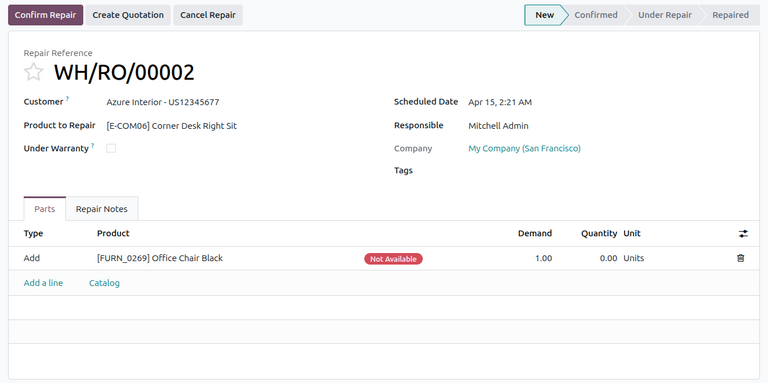
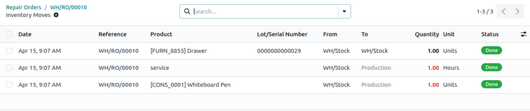

=====================
Process repair orders
=====================

.. |SO| replace:: :abbr:`SO (Sales Order)`
.. |DO| replace:: :abbr:`DO (Delivery Order)`
.. |RO| replace:: :abbr:`RO (Repair Order)`
.. |UoM| replace:: :abbr:`UoM (Unit of Measure)`

Sometimes, products delivered to customers can break or be damaged in transit, and need to be
returned for a refund, delivery of a replacement product, or repairs.

In Odoo, repairs for products returned by customers can be tracked in the **Repairs** app. Once
repaired, products can be redelivered to the customer.

The return and repair process for damaged products typically follows the below steps:

#. :ref:`Process return order for damaged product <repairs/repair_orders/return-order>`
#. :ref:`Create repair order for returned product <repairs/repair_orders/repair>`
#. :ref:`Return repaired product to customer <repairs/repair_orders/return-customer>`

.. _repairs/repair_orders/return-order:

Return order
============

Returns can be processed in Odoo via *reverse transfers*, created directly from a sales order (SO)
once products have been delivered to a customer.

To create a return, navigate to the :menuselection:`Sales app`, and click into an |SO| from which a
product should be returned. Then, from the |SO| form, click the :guilabel:`Delivery` smart button.
Doing so opens the delivery order (DO) form.

From this form, click :guilabel:`Return`. This opens a :guilabel:`Reverse Transfer` pop-up window.

.. image:: repair_orders/repair-orders-reverse-transfer.png
   :alt: Reverse transfer pop-up window on delivery order form.

This pop-up lists the :guilabel:`Product` included in the order, the :guilabel:`Quantity` delivered
to the customer, and the :guilabel:`Unit of Measure` the product was in.

Click the value in the :guilabel:`Quantity` field to change the quantity of the product to be
returned, if necessary.

Click the :guilabel:`🗑️ (trash)` icon at the far-right of the product line to remove it from the
return, if necessary.

Once ready, click :guilabel:`Return` to confirm the return. This creates a new receipt for the
returned products.

Once the product has been returned to the warehouse, receipt of the return can be registered in the
database by clicking :guilabel:`Validate` from the reverse transfer form.

.. tip::
   Once a reverse transfer for a return is validated, the value in the :guilabel:`Delivered` column
   on the original |SO| updates to reflect the difference between the original :guilabel:`Quantity`
   ordered, and the :guilabel:`Quantity` returned by the customer.

   .. image:: repair_orders/repair-orders-quantity-delivered.png
      :alt: Delivered and Quantity columns on sales order after return.

.. _repairs/repair_orders/repair:

Create repair order
===================

Once products have been returned, their repairs can be tracked by creating a repair order (RO).

Repair form configuration
-------------------------

To create a new |RO|, navigate to :menuselection:`Repairs app`, and click :guilabel:`New`. This
opens a blank |RO| form.

On this form, begin by selecting a :guilabel:`Customer` to whom the order should be invoiced and
delivered.

In the :guilabel:`Product to Repair` field, click the drop-down menu to select the product that
needs repair. If the product chosen is tracked by lot or serial number, an additional
:guilabel:`Lot/Serial` field appears for the user to specify the lot or serial number of the repair
product.

Next, tick the :guilabel:`Under Warranty` checkbox, if the product being repaired is covered by a
warranty. If ticked, the :guilabel:`Customer` is not charged for all the parts used in the repair
order.

After specifying details about the customer's repair, fill in the following fields:

- :guilabel:`Scheduled Date`: Specific date to start the repair.
- :guilabel:`Responsible`: Specific user in the database responsible for the repair.
- :guilabel:`Company`: Specific company this |RO| belongs to, if in a multi-company environment.
  This field is automatically populated and non-modifiable.
- :guilabel:`Tags`: Relevant tags to apply to this |RO|.

Parts tab
~~~~~~~~~

The :guilabel:`Parts` tab allows users to specify parts to add, remove, or recycle during the
repair. To specify a part, click :guilabel:`Add a line`.

In the :guilabel:`Type` column, click the box to reveal three options to choose from:

- :guilabel:`Add`: Add this component for use during the repair.
- :guilabel:`Remove`: Remove this component from the product being repaired.
- :guilabel:`Recycle`: Recycle this component during the repair, saving it for later use in the
  warehouse.

Next, configure information about the part in the remaining columns:

- :guilabel:`Product`: Select which part should be added, removed, or recycled.
- :guilabel:`Demand`: Specify the quantity of this part to be used in the repair, if necessary.
- :guilabel:`Quantity`: Automatically updated with the number of parts actually used. This field can
  be manually changed, if needed.
- :guilabel:`Unit`: Select the |UoM| for the part.

.. tip::
   To add additional columns to the line, click the :icon:`oi-settings-adjust` :guilabel:`(optional
   columns drop-down)` icon in the header row. Select the desired options to add to the line.

Repair Notes tab
~~~~~~~~~~~~~~~~

Click the :guilabel:`Repair Notes` tab to add internal notes about this specific |RO| (e.g.,
anything the user performing the repair might need to know).

Initiate repair
---------------

Once all desired configurations have been made on the |RO| form, click :guilabel:`Confirm Repair`.
This moves the |RO| to the :guilabel:`Confirmed` stage and reserves the necessary components needed
for the repair. A :guilabel:`Component Status` also appears on the |RO| form, indicating whether the
repair order is *Available* or *Not Available* based on the availability of the parts.

Once ready, click :guilabel:`Start Repair`. This moves the |RO| to the :guilabel:`Under Repair`
stage. If the |RO| should be cancelled instead, click :guilabel:`Cancel Repair`.

Once all products have been successfully repaired, the |RO| is completed. To register this in the
database, click :guilabel:`End Repair`.

.. note::
   If all parts added to the |RO| were not used, clicking :guilabel:`End Repair` causes a
   :guilabel:`Confirmation` pop-up window to appear. The pop-up window informs the user that there
   is a difference between the initial demand and the actual quantity used for the repair order.

   To validate, click :guilabel:`Ok`. Otherwise, click :guilabel:`Cancel`.

Ending the repair moves the |RO| to the :guilabel:`Repaired` stage. A :guilabel:`Product Moves`
smart button also appears above the form.

Click the :guilabel:`Product Moves` smart button to view the product's moves history during and
after the repair process.

.. _repairs/repair_orders/return-customer:

Return product to customer
==========================

If the product is under warranty, it can be returned to the customer after the repair.

However, if the product is not under warranty, click :guilabel:`Create Quotation`. This opens a new
|SO| form, pre-populated with the parts used in the |RO|, with the total cost of the repair
calculated.

.. image:: repair_orders/repair-orders-new-quotation.png
   :alt: Pre-populated new quotation for parts included in repair order.

If this |SO| should be sent to the customer, click :guilabel:`Confirm`, and proceed to invoice the
customer for the repair.

.. tip::
   If the customer should be charged for a repair service, a service type product can be created and
   added to the |SO| for a repaired product.

To return the product to the customer, navigate to the :menuselection:`Sales app`, and select the
original |SO| from which the initial return was processed. Then, click the :guilabel:`Delivery`
smart button.

From the resulting list of operations, click the reverse transfer, indicated by the
:guilabel:`Source Document`, which should read `Return of WH/OUT/XXXXX`.

This opens the return form. At the top of this form, a :guilabel:`Repair Orders` smart button now
appears, linking this return to the completed |RO|.

Click :guilabel:`Return` at the top of the form. This opens a :guilabel:`Reverse Transfer` pop-up
window.

.. image:: repair_orders/repair-orders-reverse-transfer.png
   :alt: Reverse transfer pop-up window on delivery order form.

This pop-up lists the :guilabel:`Product` included in the order, the :guilabel:`Quantity` delivered
to the customer, and the :guilabel:`Unit of Measure` the product was in.

Click the value in the :guilabel:`Quantity` field to change the quantity of the product to be
returned, if necessary.

Click the :guilabel:`🗑️ (trash)` icon at the far-right of the product line to remove it from the
return, if necessary.

Once ready, click :guilabel:`Return` to confirm the return. This creates a new delivery for the
returned products.

When the delivery has been processed and the product has been returned to the customer, click
:guilabel:`Validate` to validate the delivery.

.. seealso::
   :doc:`../../sales/sales/products_prices/returns`
