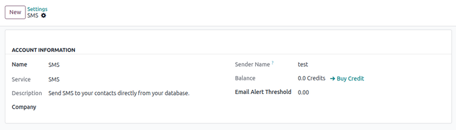
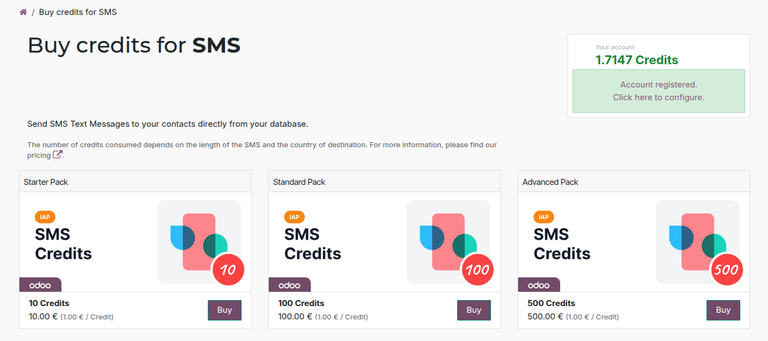
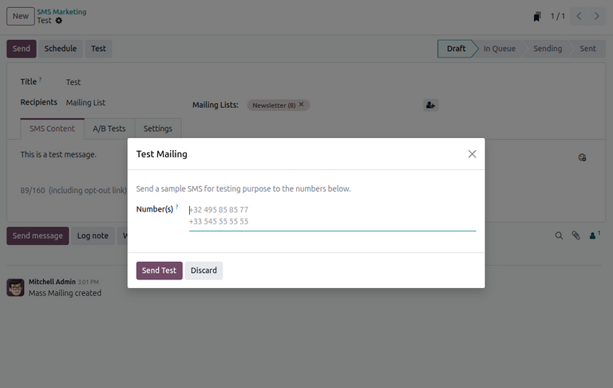

===============
Basic SMS setup
===============

Odoo **SMS Marketing** allows users to send SMS text messages in one of two ways:

#. Using Odoo's out-of-the-box :abbr:`IAP (In-app purchases)` service.
#. Using a third-party :doc:`Twilio integration <twilio>`.

The following documentation covers the configuration process for users to send SMS messages using
Odoo :abbr:`IAP (In-app purchases)`.

Built-in SMS configuration
==========================

In Odoo, SMS text messaging is an :abbr:`IAP (In-app purchases)` service that sends messages
directly from the database using prepaid :ref:`IAP credits <in_app_purchase/credits>`.

Each time a user sends an SMS message in Odoo, credits are deducted from the database's IAP account.
The pricing of the message depends on the destination and number of characters in the message. See
`Odoo SMS - FAQ <https://iap-services.odoo.com/iap/sms/pricing#sms_faq_01>`_ for a list of prices
per country.

The built-in SMS option allows users to send messages immediately with minimal configuration. The
following steps explain how to set it up and use it.

.. tip::
   Users needing more extensive configuration or that must adhere to stricter compliance regulations
   (e.g., in the US or Canada) may use Twilio instead, although pricing may vary from the built-in
   option.

Register SMS account
--------------------

Before SMS messages can be sent, an SMS account must be registered through the :abbr:`IAP
(In-app-purchases)` service and purchase the required credits needed to send SMS messages.

To register an SMS account, open the **Settings** app and scroll to the *Contacts* section. Under
the :guilabel:`Send SMS` field, make sure the :guilabel:`Send via Odoo` option is selected. Then,
click :icon:`oi-arrow-right` :guilabel:`Manage Service & Buy Credits` to open the SMS account
settings page.

.. note::
   The :guilabel:`Send via Odoo` only appears if the **Twilio** module is installed. An additional
   :guilabel:`Send via Twilio` option also appears.

For first-time users, a highlighted warning message appears at the top of the page, indicating the
account is not registered. Click :icon:`oi-arrow-right` :guilabel:`Register` next to the message to
register an SMS account, and a *Register Account* pop-up window appears. Enter a mobile phone number
to receive an SMS verification code. Once entered, click :guilabel:`Send verification code`.

After receiving the code, enter it in the :guilabel:`Verification Code` field. Then, click
:guilabel:`Register` to continue.

On the *Choose your sender name* pop-up window, enter a sender name between 3 and 11 alphanumeric
characters. Once set, this name **cannot** be modified.

Once entered, click :guilabel:`Set sender name`. Alternatively, click :guilabel:`Skip for now` to
continue without setting a sender name.

.. note::
   If a sender name is not set, SMS messages are sent from a short code. A :icon:`oi-arrow-right`
   :guilabel:`Set Sender Name` option appears on the SMS account settings page for the user to
   configure when desired.

Purchase credits
----------------

To purchase credits, open the **Settings** app and scroll to the *Contacts* section. Ensure that
:guilabel:`Send via Odoo` is selected under *Send SMS*, then click :icon:`oi-arrow-right`
:guilabel:`Manage Service & Buy Credits`.

On the SMS account settings page, click :icon:`oi-arrow-right` :guilabel:`Buy Credit` next to the
:guilabel:`Balance` field.

The user is then directed to a :guilabel:`Buy credits for SMS` page on the :abbr:`IAP (In-app
purchases)` portal, displaying various credit packs available for purchase.

To purchase credits, click :guilabel:`Buy` under the desired credit pack. Then, follow the prompts
on the Odoo payment page to finalize the order.

.. note::
   The SMS account settings page can also be accessed by navigating to the **Settings** app,
   scrolling to the *Contacts* section, then clicking :icon:`oi-arrow-right` :guilabel:`View My
   Services` under *Odoo IAP*.

   On the resulting dashboard of IAP accounts in the database, select :guilabel:`SMS` to open the
   SMS account settings page.

Testing
=======

After configuration, users can test that the SMS service works by sending a :ref:`test marketing
campaign message <sms_marketing/sms_configuration/testing/campaign-test>` or by sending an SMS
:ref:`directly from a contact form <sms_marketing/sms_configuration/testing/contact-test>`.

.. _sms_marketing/sms_configuration/testing/campaign-test:

Marketing campaign test message
-------------------------------

To send a test SMS message, open the **SMS Marketing** app. Select an existing SMS marketing
campaign or :doc:`create a new one <marketing_campaigns>`.

Ensure there is text in the :guilabel:`SMS Content` tab of the campaign form, then click
:guilabel:`Test`. A *Test Mailing* pop-up window appears.

Enter a test mobile number, then click :guilabel:`Send Test`. The user can then verify that an SMS
message has been sent.

.. note::
   In the *Settings* tab of the campaign form, the user can choose to include an opt-out link in the
   SMS message. Note that this link counts towards the pricing of the message.

.. _sms_marketing/sms_configuration/testing/contact-test:

Contact form test message
-------------------------

Alternatively, users can also test SMS messages by directly sending a real message through a contact
form. To do this, open the **Contacts** app and select a contact record. Click the :icon:`fa-cog`
:guilabel:`(gear)` icon and select :guilabel:`Send SMS`. A *Send SMS* pop-up window appears.

Enter a message in the text box, then click :guilabel:`Send`.

The user can then verify that an SMS message has been sent in the chatter next to the contact form.

.. seealso::
   - :doc:`twilio`
   - :doc:`pricing_and_faq`
