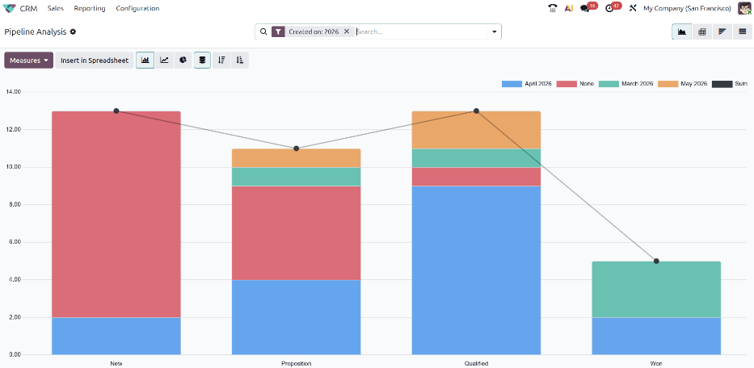
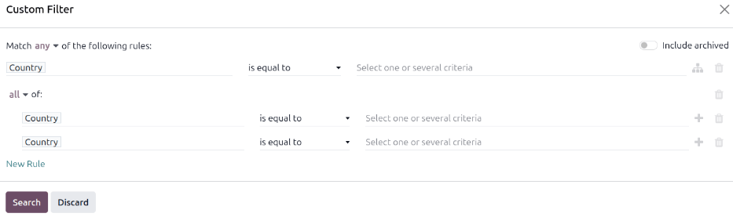
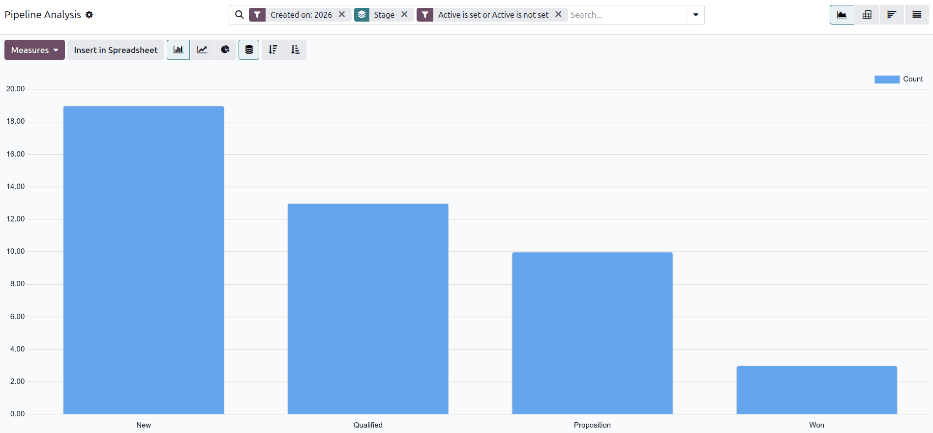

=================
Pipeline Analysis
=================

The *CRM* app manages the sales pipeline as leads/opportunities move from stage to stage, ultimately
being either *Won* or *Lost*.

After organizing the pipeline, use the search options and reports available on the *Pipeline
Analysis* page to gain insight into the effectiveness of the pipeline and its users.

To access the *Pipeline Analysis* page, go to :menuselection:`CRM app --> Reporting --> Pipeline`.

.. image:: win_loss/reporting-tab-and-pipeline-view.png
   :alt: Open the CRM app and click on the Reporting tab along the top, then click Pipeline.

.. _win_loss/pipeline:

Navigate the pipeline analysis page
===================================

Upon accessing the :guilabel:`Pipeline Analysis` page, a bar graph showcasing the leads from the
past year automatically populates. The bars represent the number of leads currently in each stage of
the sales pipeline, color-coded to show the month the lead reached that stage.

The interactive elements of the :guilabel:`Pipeline Analysis` page manipulate the graph to report
different metrics in several views. From left-to-right, top-to-bottom, the elements include:

- :guilabel:`Actions`: represented by the :icon:`fa-cog` :guilabel:`(Actions)` icon, located next to
  the :guilabel:`Pipeline Analysis` page title. When clicked, a drop-down menu with three options
  appears: :guilabel:`Knowledge`, :guilabel:`Dashboard`, :guilabel:`Spreadsheet`. Each option has
  their own sub-menu. See :ref:`Save and share reports <win_loss/save_reports>` for more
  information.

  - The :guilabel:`Knowledge` option is for linking to or inserting the graph in a **Knowledge** app
    article.
  - The :guilabel:`Dashboard` option is for adding the graph to a dashboard in the **Dashboards**
    app.
  - The :guilabel:`Spreadsheet` option is for linking the graph in a spreadsheet in the
    **Documents** app.

The :guilabel:`Search...` bar shows the filters and groupings currently being applied to the graph.
To add new filters or groups, type them into the search bar, or click the :icon:`fa-sort-down`
:guilabel:`(Toggle Search Panel)` icon at the end of the bar to open a drop-down menu of options.
See :ref:`Search Options <win_loss/search>` for more information.

In the upper-right corner, there are view options represented by different icons. See :ref:`View
Options <win_loss/view>` for more information.

- :guilabel:`Graph` view: Displays the data in a bar graph. This is the default view.
- :guilabel:`Pivot` view: Displays the data in a customizable, categorized metrics table.
- :guilabel:`Cohort` view: Displays and organizes the data, based on their :guilabel:`Created on`
  and :guilabel:`Closed Date` week, day, month, quarter, or year. Week is the default setting.
- :guilabel:`List` view: Displays the data in a list.

Located on the far-left side of the page, beneath the :guilabel:`Pipeline Analysis` page title,
there are more configurable filter and view options.

- :guilabel:`Measures`: Opens a drop-down menu of different measurement options that can be seen in
  the graph, pivot, or cohort view. The :guilabel:`Measure` drop-down menu is not available in the
  list view. See :ref:`Measurement Options <win_loss/measure>` for more information.
- :guilabel:`Insert in Spreadsheet`: opens a pop-up window with options for adding a graph or pivot
  table to a spreadsheet, dashboard, or quotation template. This option is not available in the
  cohort or list view.

.. _win_loss/search:

Search options
==============

The :guilabel:`Pipeline Analysis` page can be customized with various filters and grouping options.

To add new search criteria, type the desired criteria into the search bar, or click the
:icon:`fa-sort-down` :guilabel:`(Toggle Search Panel)` icon next to the search bar to open a
drop-down menu of all options.

.. tabs::

   .. tab:: Filters

      The :guilabel:`Filters` section allows users to add pre-made and custom filters to the search
      criteria. Multiple filters can be added to a single search.

      - :guilabel:`My Pipeline`: Show leads assigned to the current user.
      - :guilabel:`Active`: Show active leads.
      - :guilabel:`Inactive`: Show inactive leads.
      - :guilabel:`Won`: Show leads that have been marked *Won*.
      - :guilabel:`Lost`: Show leads that have been marked *Lost*.
      - :guilabel:`Created on`: Show leads that were created during a specific period of time. The
        default time period is the past year, but it can be adjusted as needed.
      - :guilabel:`Expected Closing`: Show leads that are projected to close during a specific
        period of time. Closed leads are marked as having been *Won*.
      - :guilabel:`Date Closed`: Show leads that have been marked *Won* during a specific period of
        time.
      - :guilabel:`Archived`: Show leads that have been archived. Archived leads are marked Lost,
        but not all Lost leads are archived.
      - :guilabel:`Custom Filter`: Allows the user to create a custom filter with numerous options.
        See :ref:`Add Custom Filters and Groups <win_loss/custom_filters>` for more information.

      Additionally, the following options appear if the *Leads* option has been enabled in the
      **CRM** app's Configuration settings.

      - :guilabel:`Opportunities`: Show leads that have been qualified as opportunities.
      - :guilabel:`Leads`: Show leads that have yet to be qualified as opportunities.

   .. tab:: Group By

      The :guilabel:`Group By` section allows users to add pre-made and custom groupings to the
      search results. Multiple groupings can be added to split results into more manageable chunks.

      .. important::
         The order that groupings are added affects how the final results are displayed. Try
         selecting the same combinations in a different order to see what works best for each use
         case.

      - :guilabel:`Salesperson`: Groups the results by the Salesperson to whom a lead is assigned.
      - :guilabel:`Sales Team`: Groups the results by the Sales Team to whom a lead is assigned.
      - :guilabel:`City`: Groups the results by the city from which a lead originated.
      - :guilabel:`Country`: Groups the results by the country from which a lead originated.
      - :guilabel:`Company`: Groups the results by the company to which a lead belongs, if multiple
        companies are activated in the database.
      - :guilabel:`Stage`: Groups the results by the stages of the sales pipeline.
      - :guilabel:`Campaign`: Groups the results by the marketing campaign from which a lead
        originated.
      - :guilabel:`Medium`: Groups the results by the medium (Email, Google Adwords, Website, etc.)
        from which a lead originated.
      - :guilabel:`Source`: Groups the results by the source (Search engine, Lead Recall,
        Newsletter, etc.) from which a lead originated.
      - :guilabel:`Creation Date`: Groups the results by the date a lead was added to the database.
      - :guilabel:`Conversion Date`: Groups the results by the date a lead was converted to an
        opportunity.
      - :guilabel:`Expected Closing`: Groups the results by the date a lead is expected to close.
        Closed leads are marked as having been *Won*
      - :guilabel:`Closed Date`: Groups the results by the date a lead was marked *Won*.
      - :guilabel:`Lost Reason`: Groups the results by the reason selected when a lead was marked
        *Lost*.
      - :guilabel:`Custom Group`: Allows the user to create a custom group with numerous options.
        See :ref:`Adding Custom Filters and Groups <win_loss/custom_filters>` for more information.

      .. tab:: Favorites

      The :guilabel:`Favorites` section allows users to save regularly performed searches for later,
      so that they don't need to be recreated every time. Multiple sets of search terms can be
      saved, shared with others, or even set as the default for whenever the :guilabel:`Pipeline
      Analysis` page is opened.

      - :guilabel:`Save current search`: save the current search criteria for later.

        - :guilabel:`Default filter`: when saving a search, check this box to make it the default
          search filter when the :guilabel:`Pipeline Analysis` page is opened.
        - :guilabel:`Shared`: when saving a search, check this box to make it available to other
          users.

.. _win_loss/custom_filters:

Custom filters and groups
-------------------------

In addition to the pre-made options in the search bar, the :guilabel:`Pipeline Analysis` page can
also utilize custom filters and groups. Custom filters are complex rules that further customize the
search results, while custom groups display the information in a more organized fashion.

Adding a custom filter
~~~~~~~~~~~~~~~~~~~~~~

To add a custom filter, go to the :guilabel:`Pipeline Analysis` page. , click the
:icon:`fa-sort-down` :guilabel:`(Toggle Search Panel)` icon next to the :guilabel:`Search...` bar.
In the drop-down menu, click :guilabel:`Custom Filter`. The :guilabel:`Custom Filter` pop-up window
appears with a default rule (:guilabel:`Country is equal to _____`), comprised of three unique
fields. These fields can be edited to make a custom rule and multiple rules can be added to a single
custom filter.

To edit a rule, start by clicking the first field (:guilabel:`Country`, by default) and select an
option from the drop-down menu. The first field determines the primary subject of the rule. Next,
click the second field and select an option from the drop-down menu. The second field determines the
relationship of the first and third fields and is usually some form of an "is" or "is not"
statement. Finally, click the third field and select an option from the drop-down menu. The third
field determines the secondary subject of the rule. With all three fields selected, the rule is
complete.

   - To add more rules, click :guilabel:`New Rule` and repeat the above steps as needed.
   - To delete a rule, click the :icon:`fa-trash` :guilabel:`(Delete rule)` icon to the right of the
     rule.
   - To create more complex rules, click the :icon:`fa-sitemap` :guilabel:`(Add nested rule)` icon
     to the right of the rule. This adds another modifier below the rule for adding an "all of" or
     "any of" statement, as well as an :icon:`fa-plus` :guilabel:`(Add rule)` icon for adding
     additional sub-rules

Once all rules have been added, click :guilabel:`Search` to add the custom filter to the search
criteria.

To remove an active custom filter, click the :icon:`fa-close` :guilabel:`(Remove)` icon beside the
filter in the search bar.

Adding a custom group
~~~~~~~~~~~~~~~~~~~~~

On the :guilabel:`Pipeline Analysis` page, click the :icon:`fa-sort-down` :guilabel:`(Toggle Search
Panel)` icon next to the search bar. In the drop-down menu that appears, click :guilabel:`Custom
Group`. Scroll through the options in the drop-down menu, and select one or more groups.

To remove a custom group, click the :icon:`fa-close` :guilabel:`(Remove)` icon beside the custom
group in the search bar.

.. _win_loss/measure:

Measurement options
===================

By default, the :guilabel:`Pipeline Analysis` page measures the total *Count* of leads that match
the active search criteria, but it can be changed to measure other items of interest.

To change the selected measurement, click the :guilabel:`Measures` button in the top-left of the
page and select one of the following options from the drop-down menu:

- :guilabel:`Days to Assign`: Measures the number of days it took a lead to be assigned after
  creation.
- :guilabel:`Days to Close`: Measures the number of days it took a lead to be closed. Closed leads
  are marked as having been *Won*.
- :guilabel:`Days To Convert`: Measures the number of days it took a lead to be converted to an
  opportunity.
- :guilabel:`Exceeded Closing Days`: Measures the number of days by which a lead exceeded its
  Expected Closing date.
- :guilabel:`Expected Revenue`: Measures the Expected Revenue of a lead.
- :guilabel:`Prorated Revenue`: Measures the Prorated Revenue of a lead.
- :guilabel:`Count`: Measures the total amount of leads that match the search criteria.

If the **Subscriptions** app has been installed to the Odoo database, the following options also
appear under :guilabel:`Measures`.

- :guilabel:`Expected MRR`: Measures the Expected Monthly Recurring Revenue of a lead.
- :guilabel:`Prorated MRR`: Measures the Prorated Monthly Recurring Revenue of a lead.
- :guilabel:`Prorated Recurring Revenues`: Measures the Prorated Recurring Revenues of a lead.
- :guilabel:`Recurring Revenues`: Measures the Recurring Revenue of a lead.

.. _win_loss/view:

View options
============

After configuring filters, groupings, and measurements, the :guilabel:`Pipeline Analysis` page can
display the data in a variety of ways. By default, the page uses the graph view. To change the
pipeline to a different view, click one of the four view icons, located in the top-right of the
:guilabel:`Pipeline Analysis` page.

.. tabs::

   .. tab:: Graph View

      The graph view is the default selection for the :guilabel:`Pipeline Analysis` page. It
      displays the analysis as either a bar chart, line chart, or pie chart.

      This view option is useful for quickly visualizing and comparing simple relationships, like
      the :guilabel:`Count` of leads in each stage or the leads assigned to each
      :guilabel:`Salesperson`.

      With the graph view selected, the following chart types are available.

      - :guilabel:`Bar Chart`: Switches the graph to a bar chart.
      - :guilabel:`Line Chart`: Switches the graph to a line chart.
      - :guilabel:`Pie Chart`: Switches the graph to a pie chart.

      The following organization types are also available. The organization icons may be clicked
      once to activate them and clicked a second time to deactivate them.

      - :guilabel:`Stacked`: Organizes the results of each stage on top of each other in stacks.
        When deactivated, the results in each stage are shown as individual bars set next to each
        other.
      - :guilabel:`Descending`: Organizes the stages in the graph in descending order of total leads
        and opportunities from left-to-right. Depending on the currently active search criteria,
        this option may not be available.
      - :guilabel:`Ascending`: Organizes the stages in the graph in ascending order of total leads
        and opportunities from left-to-right. Depending on the currently active search criteria,
        this option may not be available.

      By default, the graph measures the :guilabel:`Count` of leads in each group, but this can be
      changed by clicking the :guilabel:`Measures` button and :ref:`selecting another option
      <win_loss/measure>` from the resulting drop-down menu.

      .. image:: win_loss/graph-view.png
         :alt: The Graph View displays the analysis as a Bar Chart, Line Chart, or Pie Chart.

   .. tab:: Pivot View

      The pivot view displays the results of the analysis as a table. By default, the table groups
      the results by the stages of the sales pipeline, and measures :guilabel:`Expected Revenue`.

      The pivot view is useful for analyzing more detailed numbers than the graph view can handle,
      or for adding the data to a spreadsheet where custom formulas can be set up.

      .. image:: win_loss/pivot-view.png
         :alt: The Pivot View displays the analysis as a table.

      With the pivot view selected, the following options are available.

      - :guilabel:`Flip Axis`: Reverses the positions of X and Y axis for the entire table.
      - :guilabel:`Expand All`: Opens the groupings in every row when additional groupings are
        selected using the :icon:`fa-plus-square` icons.
      - :guilabel:`Download xlsx`: Downloads the table as a .xlsx file usable in Excel and most
        other spreadsheet apps.

      .. note::
         The :guilabel:`Stage` grouping cannot be removed, but the measurement can be changed by
         clicking the :guilabel:`Measures` button, and selecting another option.

   .. tab:: Cohort View

      The cohort view displays the analysis as periods of time (cohorts) that can be set to days,
      weeks, months, or years. By default, :guilabel:`Week` is selected.

      This view option is useful specifically for comparing how long it has taken to close leads.

      .. image:: win_loss/cohort-view.png
         :alt: The Cohort View displays the analysis as individual weeks of the year.

      From left-to-right, top-to-bottom, the columns in the chart represent the following:

      - :guilabel:`Created On`: Rows in this column represent the weeks of the year, in which
        records matching the search criteria exist. For example, when set to :guilabel:`Week`, a row
        with the label :guilabel:`W53 2025` means the results occurred in week 52 of the year 2023.
      - :guilabel:`Measures`: Rows in the second column of the chart measure results. By default, it
        is set to :guilabel:`Count`, but can be changed by clicking the :guilabel:`Measures` button
        and selecting an option from the drop-down menu.
      - :guilabel:`Closed Date`: Rows under this header look at what percentage of the measured
        results were closed in subsequent days, weeks, months, or years, as set by the user.
      - :guilabel:`Average`: This row provides the average of all other rows in the above columns.

      The cohort view can also be downloaded as an Excel file, by clicking the :guilabel:`Download`
      icon in the top-left of the page.

   .. tab:: List View

      The list view displays a single list of all leads matching the search criteria. Clicking a
      lead opens the record for closer review. Additional details such as :guilabel:`Country`,
      :guilabel:`Medium`, and more can be added to the list by clicking the
      :icon:`oi-settings-adjust` icon in the top-right of the list.

      This view option is useful for reviewing many records at once.

      Clicking the :icon:`fa-cog` :guilabel:`(Actions)` icon opens the Actions drop-down menu, with
      options for the following:

      - :guilabel:`Import records`: Opens a page for uploading a spreadsheet of data, as well as a
        template spreadsheet to easily format that data.
      - :guilabel:`Export All`: Downloads the list as an .xlsx file.
      - :guilabel:`Knowledge`: Inserts a view of, or link to, the list in an article in the
        **Knowledge** app.
      - :guilabel:`Dashboard`: Adds the list to *My Dashboard* in the **Dashboards** app.
      - :guilabel:`Spreadsheet`: Links to or inserts the list in a spreadsheet in the **Documents**
        app.

      .. note::
         On the list view, clicking :guilabel:`New` closes the list, and opens the *New Quotation*
         page. Clicking :guilabel:`Generate Leads` opens a pop-up window for lead generation.
         Neither feature is intended to make changes to the list view.

.. _win_loss/reports:

Create reports
==============

After understanding how to :ref:`navigate the pipeline analysis page <win_loss/pipeline>`, the
:guilabel:`Pipeline Analysis` page can be used to create and share different reports. Between the
pre-made options and custom filter and groupings, almost any combination is possible.

Once created, reports can be :ref:`saved to favorites, shared with other users, and/or added to
dashboards and spreadsheets <win_loss/save_reports>`.

A few common reports that can be created using the :guilabel:`Pipeline Analysis` page are detailed
below.

.. _win_loss/win_loss:

Win/Loss reports
----------------

Win/Loss is a calculation of active or previously active leads in a pipeline that were either marked
as *Won* or *Lost* over a specific period of time. By calculating opportunities won vs.
opportunities lost, teams can clarify key performance indicators (KPIs) that are converting leads
into sales, such as specific teams or team members, certain marketing mediums or campaigns, and so
on.

.. math::
   \begin{equation}
   Win/Loss Ratio = \frac{Opportunities Won}{Opportunities Lost}
   \end{equation}

A win/loss report filters the leads from the past year, whether won or lost, and groups the results
by their stage in the pipeline. Creating this report requires a custom filter and grouping the
results by :guilabel:`Stage`.

To create a win/loss report, navigate to :menuselection:`CRM app --> Reporting --> Pipeline`. On the
:guilabel:`Pipeline Analysis` page, click the :icon:`fa-sort-down` :guilabel:`(Toggle Search Panel)`
icon next to the search bar to open a drop-down menu of filters and groupings. In drop-down menu
that appears, under the :guilabel:`Group By` heading, click :guilabel:`Stage`. Under the
:guilabel:`Filters` heading, click :guilabel:`Custom Filter` to open another pop-up form. In the
:guilabel:`Custom Filter` pop-up, click on the first field in the :guilabel:`Match any of the
following rules:` section. By default, this field displays :guilabel:`Country`.

Clicking that first field reveals a sub-menu with numerous options to choose from. From this
sub-menu, locate and select the :guilabel:`Active` option. Doing so automatically populates the
remaining fields. The first field should read: :guilabel:`Active`, and the second field should read:
:guilabel:`is set`. In total, the rule reads: :guilabel:`Active is set`.

Click the :guilabel:`New Rule` link and change the first field to :guilabel:`Active` and the second
field to :guilabel:`is not set`. In total, the rule reads :guilabel:`Active is not set`. Click
:guilabel:`Search`.

The report now displays the total :guilabel:`Count` of both *Won* and *Lost* leads grouped by their
stage in the CRM pipeline. Hover over a section of the report to see the number of leads in that
stage.

Customize win/loss reports
~~~~~~~~~~~~~~~~~~~~~~~~~~

After :ref:`creating a win/loss report <win_loss/win_loss>`, consider using the options below to
customize the report for different needs. For example, a sales manager might find it useful to group
wins and losses by salesperson or sales team to see who has the best conversion rate. A marketing
team might group by sources or medium to determine where their advertising has been most successful.

.. tabs::

   .. tab:: Filters and groups

      To add more filters and groups, click the :icon:`fa-sort-down` :guilabel:`(Toggle Search
      Panel)` icon, next to the search bar and select one or more options from the drop-down menu.

      Some useful options include:

      - :guilabel:`Created on`: Adjust this filter for results for specific periods of time.
      - :guilabel:`Custom Filter`: Click this option to add additional search criteria, like
        :guilabel:`Last Stage Update` or :guilabel:`Lost Reason`.
      - :guilabel:`Custom Group`: Click :menuselection:`Add Custom Group --> Active` to separate the
        results and show at what stages leads are being marked as *Won* or *Lost*.

      It's possible to add multiple :guilabel:`Group By` selections to split results into more
      relevant and manageable chunks.

        - Adding :guilabel:`Salesperson` or :guilabel:`Sales Team` breaks up the total count of
          leads in each :guilabel:`Stage`.
        - Adding :guilabel:`Medium` or :guilabel:`Source` can reveal what marketing avenues generate
          more sales.

      .. image:: win_loss/search-panel-filters-and-group-by-options.png
         :alt: The Search menu open and the Won and Lost filters highlighted.

   .. tab:: Pivot View

      By default, pivot view groups win/loss reports by :guilabel:`Stage` and measures
      :guilabel:`Expected Revenue`.

      To flesh out the table, click the :icon:`fa-sort-down` :guilabel:`(Toggle Search Panel)` icon
      next to the search bar. In the pop-up menu, choose a grouping like :guilabel:`Salesperson` or
      :guilabel:`Medium`. Click the :guilabel:`Measures` button and click :guilabel:`Count` to add
      the number of leads to the report. Other useful measures for the pivot view include
      :guilabel:`Days to Assign` and :guilabel:`Days to Close`.

      .. image:: win_loss/win-loss-pivot-view.png
         :alt: A win/loss report in Pivot View displays the data in table form.

      .. important::
         In pivot view, the :guilabel:`Insert In Spreadsheet` button may be greyed out due to the
         report containing duplicate grouping options. To fix this, remove the :guilabel:`Stage`
         grouping in the search bar.

   .. tab:: List View

      In list view, a win/loss report displays all leads on a single page.

      To better organize the list, click the :icon:`fa-sort-down` :guilabel:`(Toggle Search Panel)`
      next to the search bar and add more relevant groupings or re-organize the existing ones. To
      re-order the nesting, remove all :guilabel:`Group By` options and re-add them in the desired
      order.

      To add more columns to the list, click the :icon:`oi-settings-adjust` icon in the top-right of
      the page. Select options from the resulting drop-down menu. Some useful filters include:

         - :guilabel:`Campaign`: Shows the marketing campaign that originated each lead.
         - :guilabel:`Medium`: Shows the marketing medium (Banner, Direct, Email, Google Adwords,
           Phone, Website, etc.) that originated each lead.
         - :guilabel:`Source``: Shows the source of each lead (Newsletter, Lead Recall, Search
           Engine, etc.).

.. _win_loss/save_reports:

Save and share reports
======================

After :ref:`creating a report <win_loss/reports>`, the search criteria can be saved so that the
report does not need to be created again in the future. Saved searches automatically update their
results every time the report is opened.

Additionally, reports can be shared with others or added to spreadsheets/dashboards for greater
customization and easier access.

.. tabs::

   .. tab:: Save to Favorites

      To save a report for later, go to the :guilabel:`Pipeline Analysis` page and click the
      :icon:`fa-sort-down` :guilabel:`(Toggle Search Panel)` next to the search bar. In the
      drop-down menu that appears, click :guilabel:`Save current search` under the
      :guilabel:`Favorites` heading. In the next drop-down menu that appears, enter a name for the
      report in the :guilabel:`Pipeline Analysis` field. Checking the :guilabel:`Default filter` box
      sets this report as the default analysis when the :guilabel:`Pipeline Analysis` page is
      accessed. Finally, click :guilabel:`Save`. The report is now saved under the
      :guilabel:`Favorites` heading.

   .. tab:: Add to a Spreadsheet

      Inserting a report into a spreadsheet not only saves a copy of the report, it allows users to
      add charts and formulas like in an Excel file. Saved reports are viewable in the **Documents**
      app.

      To save a report as a spreadsheet in the Graph or Pivot views, click the :guilabel:`Insert in
      spreadsheet` button. In the pop-up menu that appears, click :guilabel:`Confirm`.

      In the Cohort or List views, click the :icon:`fa-cog` :guilabel:`(Actions)` icon. In the
      drop-down menu that appears, hover over :guilabel:`Spreadsheet`. In the next drop-down menu,
      click :guilabel:`Link menu in spreadsheet`.

      .. tip::
         After modifying a spreadsheet and adding additional formulas, consider then adding the
         entire spreadsheet to a dashboard. Using this method, the spreadsheet can be added to a
         public dashboard instead of only being available in :guilabel:`My Dashboard`.

         To add the spreadsheet to a dashboard, click :menuselection:`File --> Add to dashboard`. In
         the pop-up menu that appears, name the spreadsheet and select a :guilabel:`Dashboard
         Section` to house the report. Finally, click :guilabel:`Create`.

   .. tab:: Add to a Dashboard

      Adding a report to a dashboard saves it for later and makes it easy to view alongside the rest
      of :guilabel:`My Dashboard`.

      To add a report to :guilabel:`My dashboard`, go to the :guilabel:`Pipeline Analysis` page and
      click the :icon:`fa-cog` :guilabel:`(Actions)` icon. In the drop-down menu that appears, hover
      over :guilabel:`Dashboard`. In the :guilabel:`Add to my dashboard` drop-down menu, enter a
      name for the report in the :guilabel:`Pipeline Analysis` field and click :guilabel:`Add`.

      To view a saved report, return to the main apps page, and navigate to
      :menuselection:`Dashboards app --> My Dashboard`.

.. seealso::
   - :doc:`../acquire_leads/convert`
   - :doc:`../acquire_leads/send_quotes`
   - :doc:`../pipeline/lost_opportunities`
