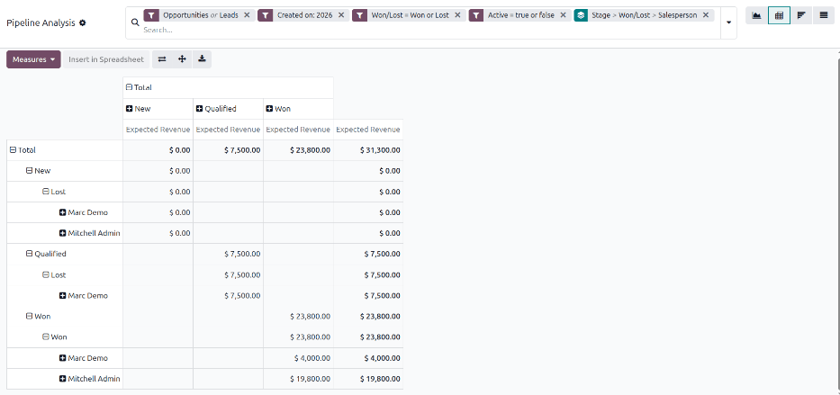
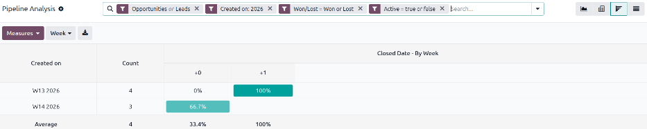
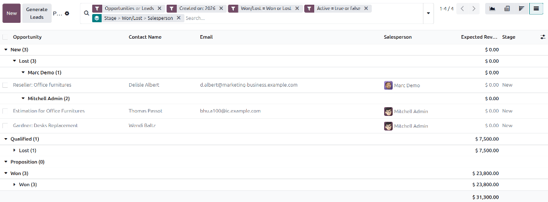

=================
Pipeline Analysis
=================

The **CRM** app manages the sales pipeline as leads and opportunities move from stage to stage,
ultimately being either won or lost. After organizing the pipeline, the search options and reports
available on the *Pipeline Analysis* page can be used to gain insight into the effectiveness of
campaigns, salespeople, and more.

.. note::
  The **CRM** app supports using leads as an intermediate qualifying step before creating a formal
  opportunity. For the purposes of this article, the term *opportunity* is used, but the information
  applies to leads as well. This article assumes :ref:`leads have been enabled
  <crm/configure-leads>` in the **CRM** app's configuration settings.

.. _win_loss/pipeline:

Pipeline analysis reports
=========================

To view the *Pipeline Analysis* page, go to :menuselection:`CRM app --> Reporting --> Pipeline`. A
stacked bar chart showcasing all opportunities created during the current year automatically loads.
The bars represent the number of opportunities currently in each stage of the sales pipeline,
color-coded to show the month the opportunity reached that stage.

.. image:: win_loss/pipeline-analysis-page.png
   :alt: The default state of the Pipeline Analysis report is a graph, with many options to change
         it.

The interactive elements of the :guilabel:`Pipeline Analysis` page manipulate the graph to report
different metrics in different views. View options are in the upper-right corner.

- :icon:`fa-area-chart` :guilabel:`Graph` view: Displays the total number of opportunities in a bar
  graph, allowing for quick visual comparisons of opportunities across CRM stages. This is the
  default view.
- :icon:`oi-view-pivot` :guilabel:`Pivot` view: Displays the detailed :guilabel:`Expected Revenue`
  by both stage and month in a customizable table. This can be modified to display information into
  more detailed categories, such as salesperson, campaign, and more.
- :icon:`oi-view-cohort` :guilabel:`Cohort` view: Displays and organizes the data based on their
  :guilabel:`Created on` and :guilabel:`Closed Date` day, week, month, quarter, or year. This allows
  for easy identification of patterns over certain time periods. Week is the default setting.
- :icon:`oi-view-list` :guilabel:`List` view: Displays the opportunities in a detailed list,
  allowing for easy viewing of detailed individual records.

.. _win_loss/search:

Filters and groupings
=====================

The :guilabel:`Pipeline Analysis` page can be customized with various filters and grouping options.

Filters
-------

The :icon:`fa-filter` :guilabel:`Filters` section allows users to add pre-made and custom filters to
the search criteria. Multiple filters can be added to a single search.

- :guilabel:`My Pipeline`: Show opportunities assigned to the current user.
- :guilabel:`Active`: Show active opportunities. Active opportunities are those that appear in the
  CRM pipeline as *Ongoing* or *Rotting*.
- :guilabel:`Inactive`: Show inactive opportunities. Inactive opportunities are those that appear in
  the CRM pipeline as *Lost*, *Won,* and *Archived*.
- :guilabel:`Won`: Show opportunities that have been marked *Won*.
- :guilabel:`Lost`: Show opportunities that have been marked *Lost*.
- :guilabel:`Created on`: Show opportunities that were created during a specific period of time. The
  default time period is the current year, but it can be adjusted as needed.
- :guilabel:`Expected Closing`: Show opportunities that are projected to close during a specific
  period of time. Closed opportunities are marked as having been *Won*.
- :guilabel:`Date Closed`: Show opportunities that have been marked *Won* during a specific period
  of time.
- :guilabel:`Archived`: Show opportunities that have been archived. *Lost* opportunities are
  automatically archived, but not all archived opportunities are marked as *Lost*.
- :guilabel:`Custom Filter`: Allows the user to create a custom filter with numerous options.

Additionally, the following options appear if the *Opportunities* option has been enabled in the
**CRM** app's Configuration settings.

- :guilabel:`Opportunities`: Show leads that have been qualified as opportunities.
- :guilabel:`Leads`: Show leads that have yet to be qualified as opportunities.

Groupings
---------

The :icon:`oi-group` :guilabel:`Group By` section allows users to add pre-made and custom groupings
to the search results. Multiple groupings can be added to split results into more manageable chunks.
The order of the selected groupings determines how results are displayed, as each grouping is
applied in sequence.

.. tip::
   The **CRM** app uses the features of the **Marketing Automation** app for tracking
   campaign-related statistics. For more information about campaigns, mediums, and sources,
   :doc:`see the Marketing Automation documentation <../../../marketing/marketing_automation>`.

- :guilabel:`Salesperson`: Groups the results by the Salesperson to whom an opportunity is assigned.
- :guilabel:`Sales Team`: Groups the results by the Sales Team to whom an opportunity is assigned.
- :guilabel:`City`: Groups the results by the city from which an opportunity originated.
- :guilabel:`Country`: Groups the results by the country from which an opportunity originated.
- :guilabel:`Company`: Groups the results by the company to which an opportunity belongs, if
  multiple companies are activated in the database.
- :guilabel:`Stage`: Groups the results by the stages of the sales pipeline.
- :guilabel:`Campaign`: Groups the results by the marketing campaign from which an opportunity
  originated.
- :guilabel:`Medium`: Groups the results by the medium (Email, Google Adwords, Website, etc.) from
  which an opportunity originated.
- :guilabel:`Source`: Groups the results by the source (Search engine, Lead Recall, Newsletter,
  etc.) from which an opportunity originated.
- :guilabel:`Creation Date`: Groups the results by the date an opportunity was added to the
  database.
- :guilabel:`Conversion Date`: Groups the results by the date an opportunity was converted to an
  opportunity.
- :guilabel:`Expected Closing`: Groups the results by the date an opportunity is expected to close.
  Closed opportunities are marked as having been *Won*.
- :guilabel:`Closed Date`: Groups the results by the date an opportunity was marked *Won*.
- :guilabel:`Lost Reason`: Groups the results by the reason selected when an opportunity  was marked
  *Lost*.
- :guilabel:`Custom Group`: Allows the user to create a custom group with numerous options.

.. tip::
   Visit the :doc:`Search, filter, and group records <../../../essentials/search>` documentation for
   more information about custom filters and groups.

.. _win_loss/measure:

Measures
========

By default, the :guilabel:`Pipeline Analysis` page measures the total *Count*, or number of
opportunities, for the current year. To change the displayed opportunities, click the
:guilabel:`Measures` button in the top-left of the page and select one of the following options from
the drop-down menu:

- :guilabel:`Days to Assign`: Measures the number of days it took an opportunity to be assigned
  after creation.
- :guilabel:`Days to Close`: Measures the number of days it took an opportunity to be closed. Closed
  opportunities are marked as having been *Won*.
- :guilabel:`Days To Convert`: Measures the number of days it took an opportunity to be converted to
  an opportunity.
- :guilabel:`Exceeded Closing Days`: Measures the number of days by which an opportunity exceeded
  its expected closing date.
- :guilabel:`Expected Revenue`: Measures the expected revenue of an opportunity.
- :guilabel:`Prorated Revenue`: Measures the prorated revenue of an opportunity.
- :guilabel:`Count`: Measures the total amount of opportunities that match the search criteria.

If the **Subscriptions** app has been installed to the Odoo database, the following options also
appear under :guilabel:`Measures`.

- :guilabel:`Expected MRR`: Measures the expected monthly recurring revenue of an opportunity.
- :guilabel:`Prorated MRR`: Measures the prorated monthly recurring revenue of an opportunity.
- :guilabel:`Prorated Recurring Revenues`: Measures the prorated recurring revenues of an
  opportunity.
- :guilabel:`Recurring Revenues`: Measures the recurring revenue of an opportunity.

.. _win_loss/reports:

Win/loss report
===============

After understanding how to :ref:`navigate the pipeline analysis page <win_loss/pipeline>`, the
:guilabel:`Pipeline Analysis` page can be used to create and share different reports, such as
win/loss reports.

Win/Loss reports are a calculation of active or previously active opportunities in a pipeline that
were either marked as *Won* or *Lost* over a specific period of time. By calculating opportunities
won vs. opportunities lost, win/loss reports can present different information for different needs.
For example, a sales manager might find it useful to group wins and losses by salesperson or sales
team to see who has the best conversion rate. A marketing team might group by sources or medium to
determine where their advertising has been most successful.

.. math::
   \begin{equation}
   Win/Loss Ratio = \frac{Opportunities Won}{Opportunities Lost}
   \end{equation}

A win/loss report for the current year, with results grouped by :guilabel:`Stage`,
:guilabel:`Won/Lost` status, and :guilabel:`Salesperson`, allows managers to determine when leads
and opportunities are lost or won, and which salespeople were handling them at the time.

To create the report, navigate to :menuselection:`CRM app --> Reporting --> Pipeline`. On the
:guilabel:`Pipeline Analysis` page, click the :icon:`fa-sort-down` :guilabel:`(Toggle Search Panel)`
icon at the end of the search bar to open a drop-down menu of filters and groupings. Under the
:icon:`fa-filter` :guilabel:`Filters` heading, ensure both :guilabel:`Opportunities` and
:guilabel:`Leads` have been enabled to capture results for both.

Next, click :guilabel:`Custom Filter...` to bring up the *Custom Filter* pop-up window. Set the
first field to :guilabel:`Won/Lost`, and set the last field to :guilabel:`Won` . Add another rule by
clicking :guilabel:`New Rule`, and set the last field to :guilabel:`Lost`. Finally, enable the
toggle :guilabel:`Include archived` in the top-right of the form, and click :guilabel:`Search`.

.. important::
   Activating the :guilabel:`Include archived` toggle when creating win/loss reports guarantees that
   any archived *Lost* opportunities appear in the report. Without using the toggle or creating a
   rule that filters for both active and inactive opportunities, it's possible for a report to not
   include lost opportunities even with the :guilabel:`Lost` filter active.

In the search bar, choose :guilabel:`Stage` under the :icon:`oi-group` :guilabel:`Group By` heading.
Then click :guilabel:`Custom Group` and choose :guilabel:`Won/Lost` from the drop-down menu.
Finally, activate the :guilabel:`Salesperson` option. By default, the data will appear with
different results stacked on top of each other according to their stage. To view the bars in this
chart side-by-side, deactivate the :icon:`fa-database` :guilabel:`(Stacked)` toggle.

Because options under the :icon:`oi-group` :guilabel:`Group By` heading are applied sequentially,
this set-up ensures that the visual output for the report emphasizes the stage when opportunities
were lost and then who was handling them when that occurred. Each column represents the number of
opportunities in a stage that are assigned to a specific salesperson and won or lost. Clicking one
of the columns opens a list view of the individual opportunities with *won* opportunities shown in
bold and *lost* opportunities appearing greyed out.

Switching into other views after setting up this example report can help demonstrate the different
use cases for those views.

.. image:: win_loss/basic-win-loss-report.png
   :alt: A basic win/loss report showing all opportunities whether won or lost grouped by stage.

Pivot view
----------

By default, the pivot view groups win/loss reports by :guilabel:`Stage` and measures
:guilabel:`Expected Revenue`. The data on the pivot table can be adjusted by clicking the
:guilabel:`Measures` button and choosing from the drop-down. Pivot tables make it especially easy to
see the relationship between the chosen search filters and groupings and revenue.

.. important::
   In pivot view, the :guilabel:`Insert In Spreadsheet` button may be greyed out due to the report
   containing duplicate grouping options. To fix this, remove the :guilabel:`Stage` grouping in the
   search bar.

Cohort view
-----------

By default, the cohort view groups win/loss reports by the dates they were :guilabel:`Created on`
and :guilabel:`Closed Date`. The Cohort view makes it easy to identify productive and slow periods
for businesses. The Cohort view does not support custom groupings of data.

List view
---------

In list view, a win/loss report displays all opportunities on a single page. This view is useful for
being able to see the details of opportunities while still having them grouped according to the
chosen search filters and groupings.

By default, the :guilabel:`Opportunity`, :guilabel:`Contact Name`, :guilabel:`Email`,
:guilabel:`Salesperson`, :guilabel:`Expected Revenue`, and :guilabel:`Stage` columns are visible in
this view. To add more columns to the list, click the :icon:`oi-settings-adjust` icon in the
top-right of the page. Select options from the resulting drop-down menu.

.. seealso::
   - :doc:`../acquire_leads/convert`
   - :doc:`../acquire_leads/send_quotes`
   - :doc:`../pipeline/lost_opportunities`
