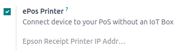

================
Receipt printers
================

ePOS printers are designed to work seamlessly with Point of Sale systems. Once connected, these
devices automatically share information, allowing for direct printing of tickets from the POS system
to the ePOS printer.

Configuration
=============

To use an ePos printer in Point of Sale:

#. :ref:`Access the POS settings <pos/use/settings>`.
#. Activate the :guilabel:`ePos Printer` feature.
#. Fill in the field with your ePos IP address.

.. note::
   When the printer connects to a network, it automatically prints a ticket with its IP address.

.. _pos/epos_printers/supported-printers:

Directly supported ePOS printers
================================

The **Epson TM-m30 i/ii/iii (Wi-Fi or Ethernet only) models** are strongly recommended, as they have
been fully tested with Odoo Point of Sale.

Other Wi-Fi or Ethernet Epson printer models that support the **ePoS protocol** should also be
compatible.

.. important::
   - The ePoS printer must be capable of operating in HTTP mode.
   - When using :doc:`Local Network Access (LNA) <pos_lna>`, the ePOS printer must have a **static
     IP address**; otherwise, it may become unreachable. The static IP should be configured through
     the router.

.. _pos/epos_printers/iot-supported-printers:

ePOS printers with IoT system integration
=========================================

The following printers require an :doc:`IoT system </applications/general/iot/devices/printer>` to
be compatible with Odoo:

- Epson TM-T20 family (incompatible ePOS software)
- Epson TM-T88 family (incompatible ePOS software)
- Epson TM-U220 family (incompatible ePOS software)

.. important::
   - Epson printers using Wi-Fi/Ethernet connections and following the `EPOS SDK Javascript protocol
     <https://download4.epson.biz/sec_pubs/pos/reference_en/technology/epson_epos_sdk.html>`_ are
     compatible with Odoo **without** needing an :doc:`IoT system
     </applications/general/iot/devices/printer>`.
   - Thermal printers using ESC/POS are compatible **with** an :doc:`IoT system
     </applications/general/iot/devices/printer>`.
   - Epson printers using only USB connections are compatible **with** an :doc:`IoT system
     </applications/general/iot/devices/printer>`.
   - Epson printers that connect via Bluetooth are **not compatible**.

.. seealso::
   - :doc:`pos_lna`
   - :doc:`epos_ssc`
