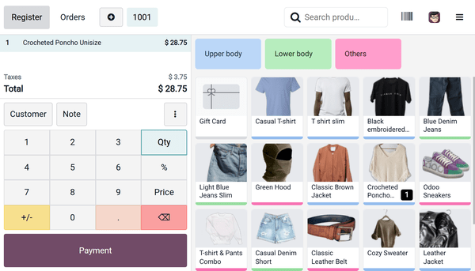
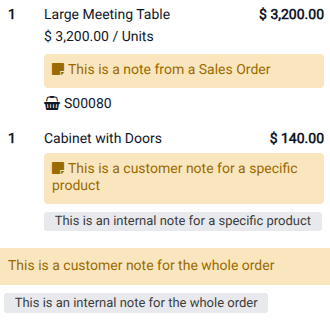

:show-content:

========
Workflow
========

.. _pos/use/create-pos:

Create a POS
============

If no point of sale exists in the database, a set of POS cards is displayed on the Point of Sale
:guilabel:`Dashboard`. Each card represents a business type. Click a card to create a POS with
preconfigured settings tailored to that type. These settings can be adjusted later as needed.

To create additional POS or to create one from scratch, go to :menuselection:`Point of Sale -->
Configuration --> Point of Sales`, click :guilabel:`New`, and type a name. Additionally, click
:guilabel:`Configurations > Settings` to fully configure the point of sale.

.. tip::
   Alternatively, go to :menuselection:`Point of Sale --> Configuration --> Settings` and click
   :guilabel:`+ New Shop` in the header.

.. important::
   - To prevent the POS app tab from slowing down, disable the `Memory Saver
     <https://support.google.com/chrome/answer/12929150?hl=en#zippy=%2Cturn-memory-saver-on-or-off>`_
     setting in Google Chrome.
   - Assign a dedicated :doc:`cash payment method <../point_of_sale/payment_methods>` and a
     :ref:`cash journal <accounting/journals/cash>` to each POS. This ensures that accounting
     entries are separated and traceable to specific points of sale.

.. seealso::
   - :doc:`shop`
   - :doc:`restaurant`

.. _pos/use/settings:

Access the POS settings
=======================

To access the general POS settings, go to :menuselection:`Point of Sale --> Configuration -->
Settings`. Then, open the :guilabel:`Point of Sale` dropdown menu and select the POS to configure.

.. image:: use/select-pos-dropdown.png
   :alt: Dropdown menu to select the POS in the app settings

.. tip::
   To configure basic settings, go to :menuselection:`Point of Sale --> Dashboard`, click the
   :icon:`fa-ellipsis-v` (:guilabel:`vertical ellipsis`) icon on the relevant POS card, then select
   :guilabel:`Configure` to perform the following actions:

   - :doc:`Enable multiple employees to log in. <extra/employee_login>`
   - :doc:`Connect and set up an IoT system. <hardware_network/pos_iot>`
   - :doc:`Connect and set up an ePOS printer. <hardware_network/epos_ssc>`

.. _pos/use/open-register:

Open the POS register
=====================

Once the POS is fully :doc:`configured <hardware_network>`, open the register to access the POS
interface. Navigate to :menuselection:`Point of Sale --> Dashboard` and:

#. On the relevant POS card, click :guilabel:`Open Register`.
#. In the :guilabel:`Opening Control` popover, ensure the :guilabel:`Opening cash` amount is
   correct.
#. Click :guilabel:`Open Register`.

.. note::
   - Once the register is open, :guilabel:`Open Register` is replaced by :guilabel:`Continue
     Selling` on the POS card.
   - You can switch between :doc:`multiple users <extra/employee_login>` from an open POS register,
     provided :ref:`multi-employee management is enabled <pos/employee_login/use>`.

From the POS interface header:

- Click :guilabel:`Register` to access the register for daily POS actions, such as :ref:`sales
  <pos/use/sell>`, :ref:`refunds <pos/use/refund>`, and more.
- Click :guilabel:`Orders` to access the POS :ref:`orders <pos/use/orders>` overview screen and
  retrieve past or ongoing orders.
- Click the :icon:`fa-plus-circle` :guilabel:`(plus)` icon to put the current order aside and start
  a new one.
- Click the order numbers to switch between ongoing orders.
- Search for products using the search bar.
- Click the :icon:`fa-barcode` (:guilabel:`barcode`) icon to use a webcam as a barcode scanner.
- Click the user's avatar to switch between employees, provided :ref:`multi-employee management is
  enabled <pos/employee_login/use>`.
- Click the :icon:`fa-bars` (:guilabel:`hamburger menu`) icon to access more advanced options, such
  as :ref:`closing the register <pos/use/register-close>`.

.. _pos/use/sell:

Sell products
=============

The POS register is divided into three sections: the cart to visualize items, the numpad for order
actions, and the product list to select items. To make sales:

#. Click on products to add them to the cart.

   - To change the quantity, click :guilabel:`Qty` and enter the number of products using the
     numpad.
   - To add a discount, click :guilabel:`%` and enter the discount value using the numpad.
   - To modify the product price, click :guilabel:`Price` and enter the new amount using the numpad.
#. Click :guilabel:`Payment` once the order is complete to proceed to checkout on the
   :guilabel:`Payment` screen.
#. Select the :doc:`payment method <payment_methods>`.
#. Enter the received amount if needed, then click :guilabel:`Validate`.
#. Click :guilabel:`New Order` on the :guilabel:`Receipt` screen to move on to the next order.

.. note::
   On the :guilabel:`Receipt` screen, the order :ref:`receipt
   <pos/configuration/receipt-configuration>` can be sent via email, SMS, or WhatsApp.

.. tip::
   - Use both `,` and `.` as decimal separators on the keyboard.
   - The first :doc:`payment method <payment_methods>` available on the :guilabel:`Payment` screen
     is selected by default if none is manually selected.

.. _pos/use/customers:

Set customers
=============

Registering customers is necessary to :ref:`collect their loyalty points and grant them rewards
<pos/pricing/loyalty>`, automatically apply an :ref:`attributed pricelist
<pos/pricing/pricelists>`, or :ref:`generate and print invoices <pos_invoices/invoices>`.

To create customers from :ref:`the POS register <pos/use/open-register>`:

#. Click :guilabel:`Customer`.
#. Click :guilabel:`Create`.
#. Complete the customer form information and click :guilabel:`Save`.

To create customers from the backend:

#. Go to :menuselection:`Point of Sale --> Orders --> Customers`.
#. Click :guilabel:`New`.
#. Fill in the customer form information and save.

To assign a customer to an order in the POS register or on the :guilabel:`Payment` screen, click
:guilabel:`Customer` and select the desired customer. To select a different customer, click the
current customer's name on the numpad, then select another one.

.. tip::
   To edit the customer's details, click the customer's name on the numpad, click the
   :icon:`fa-bars` (:guilabel:`hamburger menu`) icon next to the relevant customer, and select
   :guilabel:`Edit Details`.

.. note::
   Creating a new customer in the POS register or on the :guilabel:`Payment` screen automatically
   assigns them to the current order upon saving.

Send marketing messages
-----------------------

Customers' contact details, such as phone numbers or email addresses, are automatically stored when
:doc:`receipts <use/receipts>` are sent by email, SMS, or WhatsApp. They can then be used, for
example, for :doc:`marketing <../../marketing>` purposes.

To send marketing messages manually from the POS application, go to :menuselection:`Point of Sale
--> Orders --> Orders`, click a POS order, open the :guilabel:`Extra Info` tab, and, under the
:guilabel:`Contact Info` category, click the :icon:`fa-envelope` (:guilabel:`email`) icon or
the :icon:`fa-whatsapp` (:guilabel:`whatsapp`) icon next to the completed :guilabel:`Email` or
:guilabel:`Mobile` field.

.. note::
   Make sure a customer is assigned to the order to send marketing messages manually.

.. seealso::
   - :doc:`../../marketing/email_marketing`
   - :doc:`../../marketing/sms_marketing`
   - :doc:`../../productivity/whatsapp`

.. _pos/use/orders:

Orders overview
===============

The :guilabel:`Orders` overview allows for viewing, searching, and retrieving orders from the POS
interface. To access it, click :guilabel:`Orders` in the header.

Then, search for orders in the search bar using their:

- :guilabel:`Reference`
- :guilabel:`Receipt Number`
- :guilabel:`Invoice Number`
- :guilabel:`Date`
- :guilabel:`Customer`
- :guilabel:`Delivery Channel`
- :guilabel:`Delivery Order Status`

To filter orders based on their status, click the :guilabel:`Active` dropdown menu and select one of
the following options:

- :guilabel:`Active`: Orders currently in progress. This includes orders marked as
  :guilabel:`Ongoing`, as well as those in the :guilabel:`Payment` or the :guilabel:`Receipt` stages
  (i.e., orders for which the receipt has been emailed to the customer).
- :guilabel:`Paid`: Paid orders.
- :guilabel:`Cancelled`: Orders cancelled on online platforms through :ref:`Urban Piper
  <online_food_delivery/configuration>`.

To navigate between pages, click the :icon:`fa-caret-left` or :icon:`fa-caret-right`
(:guilabel:`caret`) icon.

To access an order in the register, click it, then click :guilabel:`Load Order`.

.. note::
   - Paid orders can be :ref:`refunded <pos/use/refund>`.
   - The :guilabel:`Delivery Channel` and :guilabel:`Delivery Order Status` dropdown options depend
     on the :ref:`Urban Piper <online_food_delivery/configuration>` setting.

.. tip::
   - To define the number of orders visible on a page, click `1-x / x`. Enter a number lower than
     the total number of pages, and click :guilabel:`Confirm`.
   - Click the :icon:`fa-trash` (:guilabel:`trash`) icon next to an :guilabel:`Active` order to
     delete it.
   - If using :doc:`presets <extra/presets>`, click one to view the related orders. Click it again
     to return to the main overview.

.. _pos/use/refund:

Return and refund products
==========================

To process a refund for a returned product from the :ref:`POS register <pos/use/open-register>`,
follow these steps:

#. Click :guilabel:`Orders` to access the :ref:`Orders overview <pos/use/orders>`.
#. Set the :guilabel:`Active` dropdown menu to :guilabel:`Paid`.
#. Select the relevant order from the list.
#. Select the items and use the numpad to set the refund quantity, then click :guilabel:`Refund`.
#. Choose how to handle the refund:

   - To refund the customer, select a payment method on the payment screen, then click
     :guilabel:`Validate`.
   - To issue a :ref:`gift card <ewallet_gift/gift-cards>` for the refund amount, click
     :guilabel:`Back`. A new order containing the returned items (with negative quantities) is
     created automatically. Then, add the gift card from the product list to the order; its value
     is automatically set to match the total refund amount. Click :guilabel:`Payment`, then
     :guilabel:`Validate` the refund.

.. note::
   Additional products cannot be added to the cart until the refund is validated.

.. tip::
   Alternatively, refunds can be processed by:

   - Clicking the :icon:`fa-ellipsis-v` (:guilabel:`vertical ellipsis`) icon in the POS register,
     then :guilabel:`Refund`.
   - Selecting the returned product(s) from the POS register and setting a negative quantity
     equal to the number of returned items. To do so, click :guilabel:`Qty` and :guilabel:`+/-`,
     then update the quantity accordingly.
   - Selecting the returned product(s) from the POS register and a :doc:`preset <extra/presets>`
     setup for the return mode.
   - Accessing the POS dashboard, navigating to :menuselection:`Point of Sale --> Orders -->
     Orders`, selecting an order, and clicking :guilabel:`Return Products`.

Once the return is validated, a corresponding credit note is generated, referencing the original
:doc:`receipt <use/receipts>` or :doc:`invoice <use/pos_invoices>`.

.. seealso::
   :doc:`/applications/finance/accounting/customer_invoices/credit_notes`

.. _pos/use/notes:

Notes
=====

Notes allow for attaching extra information to specific products in an order. There are two types of
notes: internal and customer notes.

Internal notes
--------------

Internal notes provide information intended for staff (e.g., `no tomato` for the kitchen team) and
do not appear on the customer's receipt. To add a note to an entire order, ensure no item is
selected in the cart, then click :guilabel:`Note`. To add a note to a specific item, select one from
the cart and click :guilabel:`Note`. Then, add or modify the note's content in the popover, and
click :guilabel:`Apply` once done:

     - Type the note directly into the popover.
     - Use a configured note model to save time if the same content is frequently used. Click on the
       desired note model to insert its text.

To create or edit note models, navigate to :menuselection:`Point of Sale --> Configuration -->
Note Models`, click :guilabel:`New` or the relevant note model, then complete or edit the
:guilabel:`Name` column.

Customer notes
--------------

Customer notes appear on :doc:`receipts <use/receipts>` and :doc:`invoices <use/pos_invoices>`.
They can be used, for example, to provide warranty details for a high-value item or specific care
instructions, such as `Dry clean only`.

To add a customer note from the :ref:`POS register <pos/use/open-register>` to a specific item,
select an item in the cart, click the :icon:`fa-ellipsis-v` (:guilabel:`vertical ellipsis`)
icon, click :guilabel:`Customer Note`, then add the note's content in the popover and click
:guilabel:`Apply`.

.. note::
   - If no item is selected, the note applies to the whole order.
   - Product notes from :ref:`imported sales orders <pos/shop/so>` are displayed identically in the
     cart.

.. _pos/use/cash-register:

Manage the cash register
========================

Odoo POS allows for determining which coins and bills are accepted. To set up the allowed coins and
bills:

#. Navigate to :menuselection:`Point of Sale --> Configuration --> Coins/Bills`.
#. Click :guilabel:`New` to add a new value.
#. Select the POS where this value is available in the :guilabel:`Point of Sale` column, or leave
   the field empty to make it available for all POS.

To record a cash-in or cash out transaction not associated with a sale from the POS register:

#. Click the :icon:`fa-bars` (:guilabel:`hamburger menu`) icon on the POS interface.
#. Click :guilabel:`Cash In/Out`.
#. Select :guilabel:`Cash In` or :guilabel:`Cash Out` in the popover.
#. Enter the amount in the field with the `€` sign.
#. Specify the reason for the addition or removal of cash, and click :guilabel:`Confirm`.

.. note::
   Only employees with :ref:`basic or advanced access rights <pos/employee_login/configuration>`
   are allowed to perform cash-in/out actions.

.. _pos/use/register-close:

Close the POS register
======================

To close the POS register, click the :icon:`fa-bars` (:guilabel:`hamburger menu`) icon, then
:guilabel:`Close Register`.

The :guilabel:`Closing Register` popover displays:

- The number of orders and the total amount made during the session.
- The expected amounts grouped by payment method.

Click the :icon:`fa-money` (:guilabel:`money`) icon to specify the number of coins and bills, then
click :guilabel:`Confirm`.

Click :guilabel:`Close Register` to close the register and post accounting entries.

.. tip::
   Click the :icon:`fa-clone` (:guilabel:`clone`) icon to automatically fill in the field with the
   expected cash amount.

.. note::
   - After specifying the number of coins and bills, the computed amount is set in the
     :guilabel:`Cash Count` field, and the :guilabel:`Closing Details` are specified in the
     :guilabel:`Closing Note` section.
   - When the money counted does **not** match the expected amount, a :guilabel:`Payments
     Difference` window opens automatically. Selecting :guilabel:`Proceed Anyway` validates the
     session and automatically posts the discrepancy to the designated cash difference journal.
   - Closing the register of a :doc:`restaurant <restaurant>` POS when orders are still in draft
     and not scheduled for later is not allowed and opens a popover with options to
     :guilabel:`Review Orders` or :guilabel:`Cancel Orders`.
   - It is strongly advised to close the POS register at the end of each day.

.. toctree::
   :titlesonly:

   use/receipts
   use/pos_invoices
