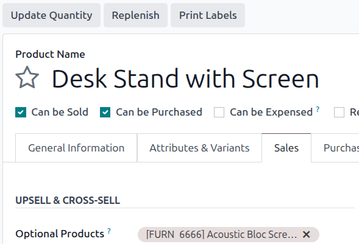
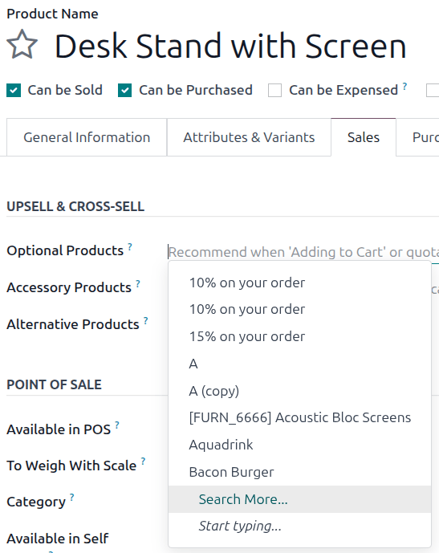
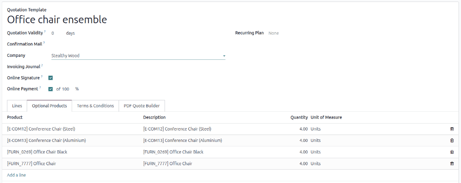
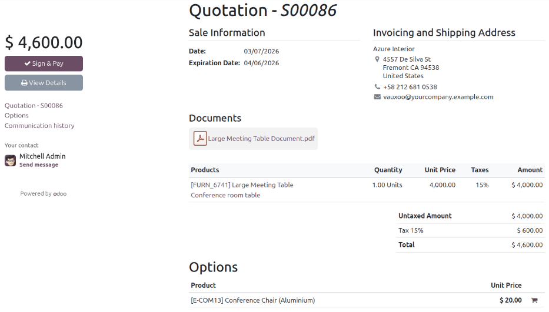

=================
Optional products
=================

The use of optional products is a marketing strategy that involves the cross-selling of useful and
related products alongside a desired core product. For instance, when a business configures optional
products in their Odoo database, an eCommerce or Website customer could be suggested a mouse and
keyboard or an extended warranty when they add a laptop to their shopping cart.

<<<<<<< e333d0f6c7e4d29887481b7302e562f2b076a35b
Optional products are automatically suggested during the quotation process whenever an associated
core product is added to a quote. They are also suggested in eCommerce interactions when a customer
adds an associated core product to their shopping cart.
||||||| 9a1d1b0c9d72dee05529f82fbffff74ab3fd580d
For instance, if a customer wants to buy a car, they have the choice to order massaging seats, as
well, or ignore the offer and simply buy the car. Presenting the choice to purchase optional
products enhances the customer experience.

Optional products on quotations
===============================

With the Odoo *Sales* application, it is possible to add or modify optional products directly on
quotations by navigating to the :guilabel:`Optional Products` tab on a quotation form.

.. image:: optional_products/optional-products-tab.png
   :align: center
   :alt: How to add optional products to your quotations on Odoo Sales.

To add an optional product(s) to a quotation, click :guilabel:`Add a product` in the
:guilabel:`Optional Products` tab of a quotation. Doing so reveals a blank field in the
:guilabel:`Product` column.

When clicked, a drop-down menu with products from the database appear. Select the desired product
from the drop-down menu to add it as an optional product to the quotation template.

.. tip::
   If the desired product isn't readily visible, type the name of the desired product in the field,
   and the option appears in the drop-down menu. Then, select that desired product to add it to the
   quotation.
=======
Optional products are automatically suggested during the quotation process whenever an associated
core product is added to a quote. They are also suggested in e-commerce interactions when a customer
adds an associated core product to their shopping cart.

.. note::
   Optional products differ from :doc:`accessory and alternative products
   </applications/websites/ecommerce/products/cross_upselling>` in terms of where they are displayed
   during customers' online shopping journeys.

Configuring optional products
=============================

With the Odoo *Sales* app, it is possible to add optional products directly to product forms. To add
an optional product, navigate to :menuselection:`Sales --> Products --> Products` and click on a
product Kanban card.

Ensure the :guilabel:`Can be Sold` option is checked, then click the :guilabel:`Sales` tab. Under
the :guilabel:`Upsell & Cross-sell` heading, the :guilabel:`Optional Products` drop-down menu allows
for optional products to be set, and are displayed in alphabetical order.

To delete an optional product from the product form,  click the :icon:`fa-times`
:guilabel:`(Delete)` icon.

Select the optional products using the drop-down menu. There is no limit to the number of optional
products that can be added.

.. tip::
   Multiple products can be selected by clicking :guilabel:`Search more...` and  *Search: Optional
   Products* pop-up window loads. Click the checkbox next to each desired product being added. When
   all optional products are selected, click :guilabel:`Select`, and all optional products appear in
   the field. If needed, new products can be created and added.
>>>>>>> 1fc79b9e1543b9388f626e83815a472a3c4a0990

<<<<<<< e333d0f6c7e4d29887481b7302e562f2b076a35b
.. note::
   Optional products differ from :ref:`accessory and alternative products
   <ecommerce/products/cross_upselling>` in terms of where they are displayed during the customer’s
   online shopping journey.
||||||| 9a1d1b0c9d72dee05529f82fbffff74ab3fd580d
.. note::
   When a product is added, the default :guilabel:`Quantity` is `1`, but that can be edited at any
   time.
=======
   .. image:: optional_products/search-optional-products-form.png
      :alt: The Search: Optional Products form accessed by clicking Search more...
>>>>>>> 1fc79b9e1543b9388f626e83815a472a3c4a0990

<<<<<<< e333d0f6c7e4d29887481b7302e562f2b076a35b
.. figure:: optional_products/optional-products-quotation.png
   :alt: A screen from the quotation process shows how optional products appear as a pop-up window.
||||||| 9a1d1b0c9d72dee05529f82fbffff74ab3fd580d
To delete any line item from the :guilabel:`Optional Products` tab, click the :guilabel:`🗑️ (trash
can)` icon.
=======
Optional products on quotation templates and quotations
=======================================================
>>>>>>> 1fc79b9e1543b9388f626e83815a472a3c4a0990

<<<<<<< e333d0f6c7e4d29887481b7302e562f2b076a35b
   Optional products as they appear during the quotation process.
||||||| 9a1d1b0c9d72dee05529f82fbffff74ab3fd580d
Click the :guilabel:`Preview` button, located in the upper-left corner of the quotation, to reveal a
preview of the quotation customers would receive, via email, along with the optional products they
can potentially add to their order, located in the :guilabel:`Options` section.
=======
Optional products can be added to quotation templates, allowing sales staff to offer related
products without needing to manually add them to each quote. Additional optional products can also
be added to individual quotations when needed.
>>>>>>> 1fc79b9e1543b9388f626e83815a472a3c4a0990

<<<<<<< e333d0f6c7e4d29887481b7302e562f2b076a35b
Configuring optional products
=============================
||||||| 9a1d1b0c9d72dee05529f82fbffff74ab3fd580d
.. image:: optional_products/optional-products-checkout.png
   :align: center
   :alt: Preview your quotations on Odoo Sales.
=======
Quotation templates
-------------------
>>>>>>> 1fc79b9e1543b9388f626e83815a472a3c4a0990

<<<<<<< e333d0f6c7e4d29887481b7302e562f2b076a35b
With the Odoo **Sales** app, it is possible to add optional products directly to product forms. To
add an optional product to a product form, navigate to :menuselection:`Sales --> Products -->
Products` and choose a product.
||||||| 9a1d1b0c9d72dee05529f82fbffff74ab3fd580d
Customers are able to add different optional products to an order by clicking the :guilabel:`🛒
(shopping cart)` icon, located to the right of the optional product line.
=======
Quotation templates also have an *Optional Products* tab, where related products or services can be
added. To add optional products to a quotation template, navigate to :menuselection:`Sales app -->
Configuration --> Quotation Templates`. Then, either select an existing quotation template to edit
or :doc:`create a new one <quote_template>`.
>>>>>>> 1fc79b9e1543b9388f626e83815a472a3c4a0990

<<<<<<< e333d0f6c7e4d29887481b7302e562f2b076a35b
Ensure that the product's :guilabel:`Sales` checkbox is checked and click the :guilabel:`Sales` tab.
Under :guilabel:`Upsell & Cross-sell` heading, the :guilabel:`Optional Products` drop-down menu
allows for optional products to be set. Products will be displayed in alphabetical order. If the
desired product isn't readily visible, type its name in the field to bring it up, then select it to
add it as an optional product.
||||||| 9a1d1b0c9d72dee05529f82fbffff74ab3fd580d
If a customer selects optional products, these are automatically added to the quotation managed by
the salesperson.
=======
On the quotation template form, click the :guilabel:`Optional Products` tab. Then, click
:guilabel:`Add a line` and select the desired product to add as an optional product to the quotation
template.
>>>>>>> 1fc79b9e1543b9388f626e83815a472a3c4a0990

<<<<<<< e333d0f6c7e4d29887481b7302e562f2b076a35b
To delete an optional product from the product form, simply click the :icon:`fa-times`
:guilabel:`(Delete)` icon.

Additional products can also be added to a core product by clicking :guilabel:`Search more...`. This
opens the :guilabel:`Search: Optional Products` form, which displays all products in the catalog and
includes the :guilabel:`New` button to create a new product. Multiple products may be selected as
optional products at once when using this form by clicking their checkboxes and then clicking
:guilabel:`Select`.

Setting optional product sections in quotations
===============================================

When developing a quotation for customers, entire sections of the quotation can be set as optional
products, even if they haven't been configured in the product form. To create a section, click the
:guilabel:`Add a section` link and enter its desired name in the :guilabel:`Enter a description`
field. Click the :icon:`fa-ellipsis-v` :guilabel:`(drop-down menu)` and choose :icon:`fa-list`
:guilabel:`Set Optional`.
||||||| 9a1d1b0c9d72dee05529f82fbffff74ab3fd580d
When the customer adds an optional product(s) to an order, the salesperson is instantly notified
about the change, along with any other change the customer makes to an order. This allows
salespeople to stay up-to-date with everything related to an order in the backend of the *Sales*
application.

Optional products on quotation templates
========================================

.. note::
   Be sure to review the :doc:`quote_template` documentation to better understand how quotation
   templates work before reading the following information.

For quotation templates, just like a typical quotation form, there is also an :guilabel:`Optional
Products` tab, wherein related products or services can be added to a quotation template.

To add optional products to a quotation template, navigate to :menuselection:`Sales app -->
Configuration --> Quotation Templates`. Then, either select an existing quotation template to edit,
or create a new one by clicking :guilabel:`New`.

On the quotation template form, click the :guilabel:`Optional Products` tab. Under the
:guilabel:`Optional Products` tab, click :guilabel:`Add a line`, and select the desired product to
add as an optional product to the quotation template.
=======
When the configured quotation template is used, the products added in the :guilabel:`Optional
Products` tab will appear in the corresponding tab in the quotation. These products can be removed
and additional products can be added before the quotation is sent to a customer.
>>>>>>> 1fc79b9e1543b9388f626e83815a472a3c4a0990

<<<<<<< e333d0f6c7e4d29887481b7302e562f2b076a35b
.. image:: optional_products/set-optional-dropdown.png
   :alt: The dropdown menu with the "Set Optional" text highlighted.

Once a section is set to optional, the font color changes to reflect its status. All products within
that section default to a quantity of `0`, ensuring they are not included in the total cost
automatically. Both portal users (such as customers or vendors) and employees with access to create
quotations and sales orders can update these quantities. Once a quantity is set to `1` or more, the
product is added to the quote total.

Once an optional product section has been created in a quotation, users who have been :doc:`granted
portal access <../../../general/users/user_portals/portal_access>` can interact with the quotation
there. They can view the quotation and decide whether or not to add the optional products to their
final sales order.

.. image:: optional_products/optional-products-section.png
   :alt: An optional products section with the quanitty and corresponding amount set to 0.
||||||| 9a1d1b0c9d72dee05529f82fbffff74ab3fd580d

The products added in the :guilabel:`Optional Products` tab are present in the quotation, by
default, whenever that particular quotation template is used. These products can be removed, and
additional products can be added, before the quotation is sent to a customer.

.. tip::
   It's best to offer optional products that would encourage a customer to add additional items to
   their order, or entice them to purchase a more expensive version of their initially selected
   product.

   For example, if a customer purchases a wooden chair, some optional products could be: a warranty
   on that chair and/or a wooden chair with leather seats.

.. note::
   There is no limit to how many optional products can be added to a quotation template.
=======

.. note::
   There is no limit to how many optional products can be added to a quotation template.
>>>>>>> 1fc79b9e1543b9388f626e83815a472a3c4a0990

Quotations
----------

To add additional products on an individual quote, navigate to :menuselection:`Sales --> Orders -->
Quotations` and select an existing quote or :doc:`create a new quote <create_quotations>`. Then open
the :guilabel:`Optional Products`. Doing so reveals a blank field in the :guilabel:`Product` column.
Click :guilabel:`Add a product`. When clicked, a drop-down menu with products from the database
appear. Select the desired product from the drop-down menu to add it as an optional product. Type
the name of the desired product or click :guilabel:`Search More...` to find additional products.

To delete any line item from the :guilabel:`Optional Products` tab, click the :icon:`fa-trash-o`
:guilabel:`(delete)` icon.

.. note::
   When a product is added, the default :guilabel:`Quantity` is `1`, but can be updated.

Previewing optional products
============================

Click the :guilabel:`Preview` button, located in the upper-left corner of the quotation, to reveal a
preview of the quotation email customers would receive. Optional products are located in the
:guilabel:`Options` section of the preview.

Customers are able to add different optional products to an order by clicking the
:icon:`fa-shopping-cart` :guilabel:`(Add to cart)` icon, located to the right of the optional
product line.

If a customer selects optional products, they are automatically added to the quotation managed by
the salesperson.

When a customer adds optional products to an order, the salesperson is instantly notified about the
change, along with any other change the customer makes to an order. This allows salespeople to stay
up-to-date with everything related to an order in the backend of the *Sales* application. Added
products appear in green in the :guilabel:`Optional Products` tab when the quote is viewed.

.. seealso::
   :doc:`quote_template`
