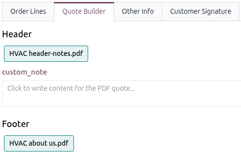
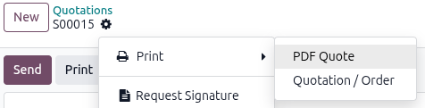

===================
Add PDFs to a quote
===================

PDFs can be manually added to a quote as a header or footer, or as an additional PDF to be merged
with the quote details. They can be accessed from the *Quote Builder* tab on a quotation. A quote
can have multiple headers or footers selected. If a quote has multiple headers or footers, they are
merged together in the order they were selected, with the quote details in between.

Add headers and footers to a quote
==================================

Navigate to :menuselection:`Sales app --> Quotations` and select the desired quotation. Click the
:guilabel:`Quote Builder` tab, and all available headers and footers are displayed in their own
self-titled sections. If any products have PDFs attached on their form, then a :guilabel:`Product`
section displays.

Select the additional PDFs to be merged into the final PDF. If a selected PDF contains :ref:`custom
note form fields <pdf_quote_builder/dynamic_text/custom-note>`, they appear as editable text boxes
to be filled in.

    displayed.

Odoo provides the option to print a PDF of the quote for record keeping. To print the PDF quote,
navigate to the confirmed quote, and click the :icon:`fa-cog` :menuselection:`Actions --> Print -->
PDF Quote`.

Open the PDF quote file to confirm the configured header, footer, and additional PDFs before
printing.

.. note::
   Download these :download:`PDF quote builder examples
   <add_pdf_quotes/pdfquotebuilderexamples.zip>` or this :download:`sample quotation
   <add_pdf_quotes/sample_quotation.pdf>` for additional reference.

.. example::
   A car dealership wants to include its vehicle purchase order form with each quotation. They
   create a PDF template of the form and upload it to the **Sales** app as a header.

   When they create a quote for a customer, they select the header in the *Quote Builder* tab and
   manually fill in the customized note form fields.

   .. image:: add_pdf_quotes/example-voc-header.png
      :alt: The Quote Builder tab with a vehicle purchase order form selected as the header.

   After the quote has been signed and confirmed, the car seller downloads and prints a copy of the
   PDF quote for the customer. The PDF quote contains the vehicle purchase order form as the header,
   the quote details in the body, and the dealership's standard footer.

Add headers and footers to a quote template
===========================================

.. important::
   Headers and footers added to a quote template are **only** available when that template is
   applied — they won't appear as standalone header/footer options for quotes.

To add PDFs to a quote template, navigate to :menuselection:`Sales app --> Configuration --> Quote
Templates`, and select the desired template. Click the :guilabel:`Quote Builder` tab and click
:guilabel:`Add Headers and footers`. In the *Add: Headers and footers* pop-up, select the PDF to be
added to the quote template. Selected PDFs are displayed in the :guilabel:`Quote Builder` tab as
cards.

To remove a header or footer, click the :icon:`fa-ellipsis-v` :guilabel:`vertical ellipsis` icon on
the card and select :guilabel:`Delete`. Deleting a header or footer from a quote template only
removes it from the template. It remains available in the *Quote Builder* tab and the
*Headers/Footers* page.

.. seealso::
   :doc:`../quote_template`

