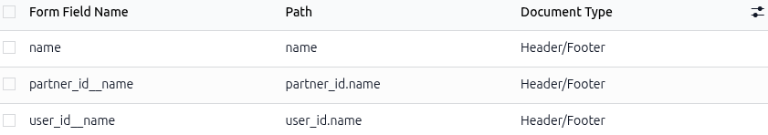
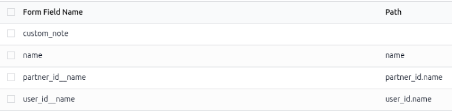
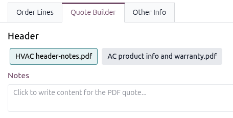

.. _Adobe: https://helpx.adobe.com/acrobat/desktop/work-with-pdf-forms/create-forms/convert-to-forms.html

=====================================
Configure dynamic form fields in PDFs
=====================================

When creating custom PDFs to import into the **Sales** app, use *dynamic form fields* to auto-fill
the PDF content with relevant information from the Odoo database, including names and prices.

*Dynamic form fields* are configurable text fields that can be added to a PDF form, and Odoo
automatically fills them with values from the sales order/product associated with the quote.

Formatting tips
===============

When designing the base PDF template for a quote’s header or footer, keep the placements of *dynamic
form field* in mind. Use the following tips to avoid overlapping text and other formatting issues:

- **Leave whitespace**: Ensure there is enough room for dynamic data to expand without overlapping
  logos or borders.
- **Add line breaks**: Place dynamic form fields, like *Customer Name*, on their own lines.
  Alternatively, put them at the end of phrases to avoid text breaking. Long names can push static
  text out of alignment.
- **Leave whitespace**: Ensure there is enough room for dynamic data to expand without overlapping
  logos or borders.
- **Add line breaks**: Place dynamic form fields, like *Customer Name*, on their own lines.
  Alternatively, put them at the end of phrases to avoid text breaking. Long names can push static
  text out of alignment. text appearance when adding or editing content.

Odoo recommends editing PDF forms with Adobe software. Form fields in header and footer templates
are required to retrieve dynamic values in Odoo.

.. tip::
   If the PDF is too large to send as an email attachment, try using "system fonts" (e.g., Arial,
   Helvetica, Times New Roman) instead of custom fonts to reduce the file size.

Create dynamic form fields in PDF
=================================

.. important::
   Odoo does not permit spaces in PDF field names. Only use letters, numbers, hyphens, or
   underscores.

To add dynamic form fields, use the preferred PDF editor, such as Adobe Acrobat Pro or Scribus.
Refer to the following instructions to:

-  Find :ref:`pdf_quote_builder/dynamic_text/common-dynamic-text-values`.
-  :ref:`pdf_quote_builder/dynamic_text/Odoo-field-path`.
-  :ref:`pdf_quote_builder/dynamic_text/custom-dynamic-form-fields` in Odoo after uploading the PDF.

Adobe Acrobat Pro
-----------------

`Convert the PDF into a PDF form <Adobe_>`_, then add a *dynamic form field* at the location where
the Odoo information should be inserted. Link the Odoo fields to the *dynamic form fields* by
double-clicking on the field to open :guilabel:`Properties`.

In the :guilabel:`General tab`, enter the name of the Odoo field for the :guilabel:`Name`. Set the
:guilabel:`Common Properties` to :guilabel:`Visible` unless the field needs to be hidden until data
is populated.

Next, click the :guilabel:`Appearance` tab and select the :guilabel:`Font Size`, :guilabel:`Font
Choice`, and :guilabel:`Text Color` to match the template's existing text or branding. Click the
:guilabel:`Options` tab and set the text alignment to match the template’s design.

Generic PDF editor
------------------

Open the PDF with the PDF editor, add a *dynamic form field* where the Odoo information is needed.
Link the Odoo fields to the *dynamic form fields* by opening the field’s :guilabel:`Properties`
window. Then, in the :guilabel:`Name` for that field, enter the name of the Odoo field.

If possible, configure the :guilabel:`Font Size`, :guilabel:`Font Choice`, and :guilabel:`Text
Color` to match the template's existing text or branding. Click the :guilabel:`Options` tab and set
the text alignment to match the template’s design.

Map PDF form fields to Odoo
===========================

This step connects any *dynamic form field* in the PDF to the corresponding Odoo field by specifying
the exact location of that information. Once the PDF file is ready, save the changes and upload it
to Odoo via :menuselection:`Sales app --> Configuration --> Headers/Footers` and clicking
:guilabel:`Upload`.

Odoo automatically detects *dynamic form fields* in the uploaded PDF and displays the
:guilabel:`Configure dynamic fields` link. Click the :guilabel:`Configure dynamic fields` link to go
to the :guilabel:`Form Fields` page.

The :guilabel:`Form Field Name` column is populated with the *dynamic form fields* from the PDF. The
:guilabel:`Path` column specifies the path to the Odoo field corresponding to each *dynamic form
field*.

To edit, click the :guilabel:`Path` cell of the desired form field row and enter  the Odoo field
name. Refer to the :ref:`pdf_quote_builder/dynamic_text/common-dynamic-text-values` section for
typical field names. Refer to the :ref:`pdf_quote_builder/dynamic_text/Odoo-field-path` section for
instructions on how to find Odoo field names and paths.

.. _pdf_quote_builder/dynamic_text/Odoo-field-path:

Find Odoo field names or paths
------------------------------

Users can enable :ref:`developer-mode` in Odoo and hover over the desired field to see its technical
name, which is the :guilabel:`Field` value in the pop-up window. Or, while in Developer Mode,
navigate to the :menuselection:`Settings --> Technical --> Email Templates` menu. In the search bar,
search for "Sales", then open a *Sales template* to see the :ref:`available dynamic form fields and
their paths <email_template/dynamic-placeholders>`.

.. _pdf_quote_builder/dynamic_text/custom-dynamic-form-fields:

Configure custom dynamic form fields
------------------------------------

To pull specific information from a sales order or a product that is not in the
:ref:`pdf_quote_builder/dynamic_text/common-dynamic-text-values` section, add a *dynamic form field*
to the PDF with a unique name, then configure the :guilabel:`Path` to point to the desired
information in Odoo.

When configuring the :guilabel:`Path`, use the dot (`.`) notation to specify relationships between
models. Headers and footers start from the current :guilabel:`sale_order` model. Product documents
follow their path from :guilabel:`sale_order_line`.

.. example::
   A company wants to display the customer's country in its quotations. To display the customer's
   country in the quotation PDF, they used the dynamic form field name
   :guilabel:`invoice_partner_country` in the PDF template. After uploading the PDF to the **Sales**
   app, they set the :guilabel:`Path` of the :guilabel:`Form Field Name` to:

   - For a header or footer document: :guilabel:`partner_invoice_id.country_id.name`

     .. figure:: dynamic_text/example-country-quotation-path.png
        :alt: The customer's country form field pathing for a quotation.

        Example of Odoo's Form Field Path for the customer's country from a quotation.

   - For a product document: :guilabel:`order_id.partner_invoice_id.country_id.name`

     .. figure:: dynamic_text/example-country-product-document-path.png
        :alt: The customer's country form field pathing from the product document.

        Example of Odoo's Form Field Path for the customer's country from a product document.

Create a custom note form field
-------------------------------

When uploading any PDF containing the form field :guilabel:`custom_note`, leaving the
:guilabel:`Path` empty allows the seller to add any note to that form field in the document, which
shown when the PDF is built.

   Leave the :guilabel:`Path` column cell empty for the :guilabel:`custom_note` row.

   The note field in the *Header* section in the :guilabel:`Quote Builder` tab on a quotation.

.. _pdf_quote_builder/dynamic_text/common-dynamic-text-values:

Common dynamic form fields
==========================

Below are common dynamic form fields to use in custom PDFs that automatically map to the correct
Odoo fields when uploaded to the **Sales** app, and what they represent.

For headers and footers PDF:

- :guilabel:`name`: Sales Order Reference
- :guilabel:`partner_id__name`: Customer Name
- :guilabel:`user_id__name`: Salesperson Name
- :guilabel:`amount_untaxed`: Untaxed Amount
- :guilabel:`amount_total`: Total Amount
- :guilabel:`delivery_date`: Delivery Date
- :guilabel:`validity_date`: Expiration Date
- :guilabel:`client_order_ref`: Customer Reference

For product PDF:

- :guilabel:`description`: Product Description
- :guilabel:`quantity`: Quantity
- :guilabel:`uom`: Unit of Measure (UoM)
- :guilabel:`price_unit`: Price Unit
- :guilabel:`discount`: Discount
- :guilabel:`product_sale_price`: Product List Price
- :guilabel:`taxes`: Taxes name joined by a comma (`,`)
- :guilabel:`tax_excl_price`: Tax Excluded Price
- :guilabel:`tax_incl_price`: Tax Included Price

.. example::
   When creating a PDF, it's best practice to use common dynamic form fields
   (:guilabel:`user_id_name`, :guilabel:`partner_id_name`, and :guilabel:`name`). When uploaded into
   the database, Odoo auto-populates those fields with the information from their respective fields.

   In this case, Odoo would auto-populate the Salesperson's name in the :guilabel:`user_id_name`
   dynamic text field, the Sales Order Reference in the :guilabel:`name` field, and the Customer
   Name in the :guilabel:`partner_id_name` field.

   .. image:: dynamic_text/pdf-quote-builder-sample.png
      :align: center
      :alt: PDF quote being built using common dynamic placeholders.

