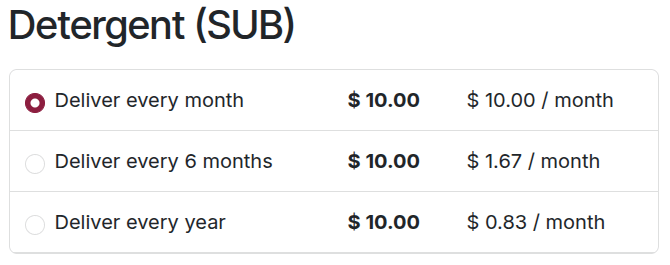

===================================
Subscriptions in the eCommerce shop
===================================

Subscription products can be sold in Odoo **eCommerce** app shops just like regular sales products.

To begin selling subscription products in an *eCommerce* shop, first :doc:`configure the product
<../subscriptions>` as a regular recurring sales product. After configuration is
complete, click the :guilabel:`Go to Website` smart button on the product's form to navigate to the
product's **eCommerce** page.

From here, review the subscription product and its recurring periods. Then, toggle the switch in the
upper-right corner from :guilabel:`Unpublished` to :guilabel:`Published`. Once published, the
subscription product is available to purchase on the eCommerce website, along with options for the
configured recurring periods.

.. seealso::
   - :doc:`Configure subscription products <../subscriptions>`
   - :doc:`Product variants <../sales/products_prices/products/variants>`
