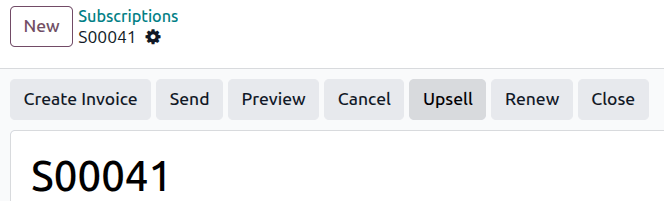
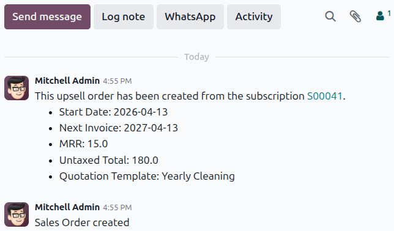
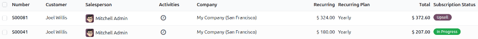

====================
Upsell subscriptions
====================

When a subscription sales order is opened, either in the **Sales** or **Subscriptions** apps, that
subscription may then be upsold via the :guilabel:`Upsell` button at the top of the sales order.

Upselling involves changing a subscription to include a more expensive product or service. Upselling
may also involve adding discounts to encourage conversion. Before sending an upsell quotation to a
customer, the unit price, taxes, and even discount may all be adjusted. Using the *Upsell* feature
allows for greater convenience and continuity when making changes to an exisiting subscription.

How to upsell a subscription
----------------------------

.. important::
   A subscription sales order **must** be invoiced before it can be upsold.

Click the :guilabel:`Upsell` button to bring up a new quotation form. This quotation's status as an
upsell is indicated by the :guilabel:`Upsell` icon in the corner of the form. The chatter for the
new form also includes information linking the upsell order to the original order.

         order.

Within the new form, the initial subscription product appears in the :guilabel:`Order Lines` tab.
The :guilabel:`Order Lines` tab also features a reminder that recurring products are prorated based
on the original subscription's starting date.

.. important::
   The prorated amount is **only** applied to *Service* product types. It is **not** applied to
   *Goods*, even if the message appears and suggests otherwise.

From this new upsell quotation form, new subscription products can be added in the :guilabel:`Order
Lines` tab, by clicking :guilabel:`Add a product` and selecting the desired subscription products.
Once the desired upsell subscription products have been added, the quotation can be sent to the
customer for approval by clicking the :guilabel:`Send` button.

Once the quotation is confirmed by the customer, the upsold products are added to the initial
subscription. The quotation's prices are then prorated based on the current invoicing period's
remaining time.

Once the customer approves, click the :guilabel:`Confirm` button on the quotation, making it a sales
order. When that's clicked, a :guilabel:`Sales History` smart button appears, displaying how many
sales orders are attached to this initial subscription sales order.

When the :guilabel:`Sales History` smart button is clicked, Odoo reveals a separate page containing
a list of the related sales orders, clearly showcasing their individual :guilabel:`Subscription
Status`.

Discount configuration
----------------------

Discounts can be easily applied to upsold subscriptions to incentivize customers to purchase more
expensive or additional subscriptions. To do this, the *Discounts* feature must be enabled.

To activate the *Discounts* feature, navigate to :menuselection:`Sales app --> Configuration -->
Settings`. Scroll to the :guilabel:`Pricing` section and tick the checkbox beside
:guilabel:`Discounts`. Finally, click :guilabel:`Save`.

Create alternative
------------------

Customers can also be presented with alternative subscription quotations. Alternative quotations can
be created even after sending an upsell quotation to a customer.

To create an alternative upsell quotation, click the :guilabel:`Create Alternative` button at the
top of the upsell quotation form. This opens a new upsell sales order that is linked to the previous
upsell and subscription sales orders.

.. seealso::
   - :doc:`../subscriptions`
   - :doc:`../sales/products_prices/prices/discounts`
