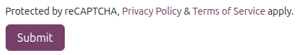

=====================
Forms spam protection
=====================

:ref:`Cloudflare Turnstile <website/spam_protection/cloudflare-turnstile>` and :ref:`Google
reCAPTCHA v3 <website/spam_protection/google-recaptcha>` protect website forms against spam and
abuse. They attempt to distinguish between human and bot submissions using non-interactive
challenges based on telemetry and visitor behavior.

.. important::
   We recommend using **Cloudflare Turnstile**, as reCAPTCHA v3 may not be compliant with local data
   protection regulations.

.. note::
   All pages using the :guilabel:`Form`, :guilabel:`Newsletter Block`, or :guilabel:`Newsletter
   Popup` snippets are protected by both tools.

.. seealso::
   - `Cloudflare Turnstile's documentation <https://developers.cloudflare.com/turnstile/>`_
   - `Google's reCAPTCHA v3 guide <https://developers.google.com/recaptcha/docs/v3>`_

.. _website/spam_protection/cloudflare-turnstile:

Cloudflare Turnstile configuration
==================================

.. _website/spam_protection/cloudflare:

On Cloudflare
-------------

#. `Create <https://dash.cloudflare.com/sign-up>`_ or `log in <https://dash.cloudflare.com/login>`_
   to a Cloudflare account.
#. In the dashboard's navigation sidebar, go to :menuselection:`Application security --> Turnstile`.
#. On the :guilabel:`Overview` page, click :icon:`fa-plus` :guilabel:`Add widget`.
#. Add a :guilabel:`Widget name` to easily identify it.
#. Click :icon:`fa-plus` :guilabel:`Add Hostnames`, enter a custom hostname (e.g., *example.com* or
   *subdomain.example.com*), then click :guilabel:`Add` twice.
#. Select a :guilabel:`Widget Mode`:

   - The :guilabel:`Managed` mode is **recommended**, as it allows Turnstile to prompt visitors to
     confirm they are human when necessary.

     .. image:: spam_protection/turnstile-human.png
        :alt: Cloudflare Turnstile human verification widget

   - For the :guilabel:`Non-interactive` and :guilabel:`Invisible` modes, visitors are never
     prompted to interact. In :guilabel:`Non-interactive` mode, a loading widget can be displayed to
     warn visitors that Turnstile protects the form; however, the widget is not supported by Odoo.

     .. note::
        If the Turnstile check fails, visitors are not able to submit the form, and the following
        error message is displayed:

        .. image:: spam_protection/turnstile-error.png
           :alt: Cloudflare Turnstile verification error message

#. Click :guilabel:`Create`.

The generated keys are then displayed. Leave the page open for convenience, as copying the keys in
Odoo is required next.

On Odoo
-------

#. From the database dashboard, open the **Settings** app. Under :guilabel:`Integrations`, enable
   :guilabel:`Cloudflare Turnstile`, then click :guilabel:`Save`.
#. Open the :ref:`Cloudflare Turnstile <website/spam_protection/cloudflare>` page, copy the
   :guilabel:`Site Key`, and paste it into the :guilabel:`CF Site Key` field in Odoo.
#. Open the Cloudflare Turnstile page, copy the :guilabel:`Secret Key`, and paste it into the
   :guilabel:`CF Secret Key` field in Odoo.
#. Click :guilabel:`Save`.

.. tip::
   Navigate to :menuselection:`Application security --> Turnstile` in your Cloudflare account to
   :guilabel:`View analytics` and access additional settings.

.. _website/spam_protection/google-recaptcha:

reCAPTCHA v3 configuration
==========================

.. warning::
   reCAPTCHA v3 may not be compliant with local data protection regulations.

On Google
---------

#. `Sign up <https://accounts.google.com/signup>`_ or `sign in <https://accounts.google.com/signin>`_
   to a Google account.
#. Open `the reCAPTCHA website registration page <https://www.google.com/recaptcha/admin/create>`_.
#. Enter a :guilabel:`Label` for the website, e.g., *example.com*.
#. Leave the :guilabel:`reCAPTCHA type` set to :guilabel:`Score based (v3)`.
#. Enter one or more :guilabel:`Domains` (e.g., *example.com* or *subdomain.example.com*).
#. Under :guilabel:`Google Cloud Platform`, a project is automatically created or selected if one
   already exists for the logged-in Google account. Click the field to select a project manually
   or rename the automatically created project.
#. Agree to the terms of service.
#. Click :guilabel:`Submit`.

The generated keys are then displayed. Leave the page open for convenience, as copying the keys in
Odoo is required next.

On Odoo
-------

#. From the database dashboard, open the **Settings** app. Under :guilabel:`Integrations`, activate
   :guilabel:`Enable reCAPTCHA`.

   .. warning::
      Do not uninstall the :guilabel:`Google reCAPTCHA integration` module, as it would also remove
      many other modules.

#. Open the :ref:`Google reCAPTCHA <website/spam_protection/google-recaptcha>` page, click
   :guilabel:`COPY SITE KEY`, and paste it into the :guilabel:`Site Key` field in Odoo.
#. Open the Google reCAPTCHA page, click :guilabel:`COPY SECRET KEY`, and paste it into the
   :guilabel:`Secret Key` field in Odoo.
#. Change the default :guilabel:`Minimum score` (`0.70`) if necessary, using a value between `0.00`
   and `1.00`. The higher the threshold is, the harder it is to pass the reCAPTCHA, and vice
   versa.
#. Click :guilabel:`Save`.

.. seealso::
   `Interpret reCAPTCHA scores - Google documentation <https://cloud.google.com/recaptcha/docs/interpret-assessment-website#interpret_scores>`_

You can notify visitors that reCAPTCHA protects a :ref:`form <website/building_blocks/form>`. To do
so, navigate to the form and open the website editor. Then, click somewhere on the form, go to the
:guilabel:`Customize` tab, and, in the :guilabel:`Form` section, enable :guilabel:`Show ReCAPTCHA
Policy`.

.. note::
   If the reCAPTCHA check fails, the following error message is displayed:

   .. image:: spam_protection/recaptcha-error.png
      :alt: Google reCAPTCHA verification error message

.. tip::
   Analytics and additional settings are available on `Google's reCAPTCHA administration page
   <https://www.google.com/recaptcha/admin/>`_. For example, you can receive email alerts if Google
   detects suspicious traffic on your website or view the percentage of suspicious requests, which
   could help you determine the right minimum score.
